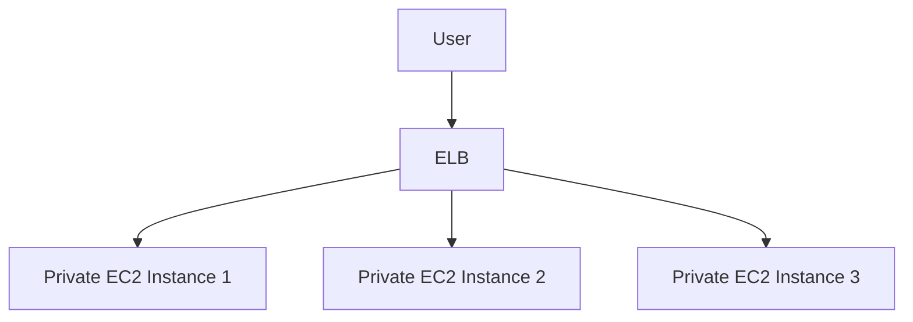

<!-- updated: 2026-07-08T07:39:59.000Z -->
## Topics Covered on 2026-06-01

---

## Security Layers in AWS Architecture
- **Onion Model**: Representing security as layers with each layer providing protection against threats.
- Implementing multiple layers makes it harder for attackers to breach systems.
- Key layers include:
  - No public IP address (use private IPs).
  - Implement Internet Gateways for specific use cases.
  - Employ route tables to control network traffic.
  - Use Security Groups (SGs) and Network Access Control Lists (NACLs) for traffic permissions.

> 🏢 **Real world**: A financial company handles highly sensitive customer data by enforcing a layered security model with private subnets, private IP addresses, and fine-grained security rules to prevent unauthorized access.

---

## Public vs Private IPs on EC2 Instances
- **Private IPs**: Used for internal communication within VPC and not accessible from outside the VPC.
- **Public IPs**: Required for direct access from the internet.
- **Elastic IPs**: Persist even if the instance is stopped and restarted.
- Public network setup requires:
  - Public/Elastic IP Address
  - Configured Internet Gateway
  - Proper routing in the Route Table

| IP Type         | Description                       | Use Case                               |
|------------------|-----------------------------------|----------------------------------------|
| **Public IP**    | Temporary; changes after reboot  | Direct access from the internet        |
| **Private IP**   | Internal network communication   | Secured resources within a VPC         |
| **Elastic IP**   | Static; does not change          | External-facing, consistent, and direct access |

> 🏢 **Real world**: A tech startup uses Elastic IPs to ensure consistent connection and avoids breaking DNS records when scaling their infrastructure.

---

## Load Balancer with Private IPs
- Public IPs are not always necessary for web servers; solutions exist for private-only networking.
- **Elastic Load Balancers (ELBs)**:
  - Can have a public-facing DNS or IP address.
  - Distribute traffic to private EC2 instances, allowing you to host services without exposing internal resources.
  - Automatically handle multiple backend EC2 instances in horizontally scaled setups.
  - Maps DNS to the ELB rather than direct instance IPs.

> 🏢 **Real world**: An e-commerce website utilizes an ELB in front of private EC2 instances to ensure secure, scalable, and fault-tolerant service for customers globally.

---

## Security Groups (SGs) and Network Access Control Lists (NACLs)
- Key tools to control inbound and outbound traffic:
  - **SGs**: Stateful; automatically allow return traffic of established connections.
  - **NACLs**: Stateless; rules must be defined for both inbound and outbound traffic.

| Feature             | Security Groups (SG)       | NACLs                    |
|----------------------|---------------------------|--------------------------|
| **Stateful/Stateless** | Stateful                 | Stateless                |
| **Applied to**       | Instances (ENI level)     | Subnets                  |
| **Rule Scope**       | Allow rules only          | Allow and Deny rules     |
| **Evaluation Order** | Evaluates all rules       | Rules evaluated in order |

- Example configuration for security groups:
  - Allow SSH (port 22) from a specific IP.
  - Allow HTTP (port 80) and HTTPS (port 443) from all IPs.

> 🏢 **Real world**: A SaaS company restricts SSH access to DevOps team members by using security groups that only allow connections from their office IP while permitting all users to access their app via HTTPS.

---

## VPC Infrastructure Components
- **Public Subnets**:
  - Contain public-facing resources.
  - Require:
    - Public/Elastic IP
    - Internet gateway
    - Route table configured for internet traffic
- **Private Subnets**:
  - Used to host internal resources (e.g., RDS, application servers).
  - Do not have internet access by default.
- **Route Tables**:
  - Define network routes for outbound and incoming traffic.
- **Network Security Checklist**:
  1. Instance MUST have an IP address (public for external access or private for internal).
  2. Internet Gateway present and properly attached.
  3. Route Table configured for desired traffic flow.
  4. Ensure Security Groups & NACLs are correctly defined.
  5. Verify specific application rules (e.g., is HTTP/SSH port open?).

> 🏢 **Real world**: A digital media agency deploys a VPC with private subnets for RDS and app servers. Public subnets are used only for a load balancer with a public-facing DNS.

---

## Best Practices in AWS Networking and Security
- Start with defaults for learning but customize for production workloads.
- Gradually refine security through experience, feedback, and documentation of troubleshooting checklists.
- Always enforce the principle of least privilege by configuring Security Groups and NACLs.
- Use guardrails and automated policies within organizations to prevent human error.

> 🏢 **Real world**: A global logistics company creates company-wide guardrails via AWS Organizations and Service Control Policies (SCPs) to enforce network configurations, ensuring compliance and preventing misconfigurations.

---

## Suggested Hands-On Practice
- Create a multi-tier architecture with:
  - A public Elastic Load Balancer (ELB).
  - Multiple EC2 instances in private subnets.
  - RDS in another private subnet with database traffic allowed via SG.
- Configure route tables and test internet-bound traffic.
- Troubleshoot connectivity using the security checklist (e.g., IP address, gateway, routing, SGs).

> 🏢 **Real world**: A healthcare provider builds VPCs with private subnets for database servers and leverages ELBs to securely expose services while meeting compliance and data security regulations.

---
