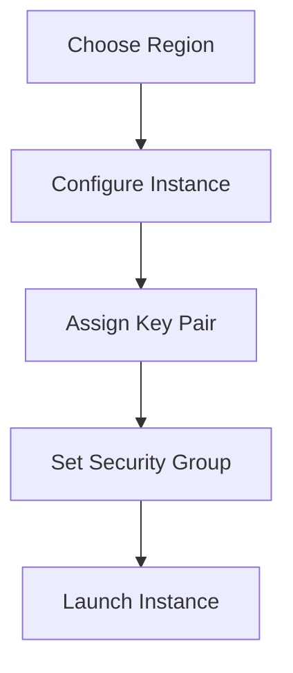

<!-- updated: 2026-07-08T07:40:56.000Z -->
## AWS Identity and Access Management (IAM)
- **Key Concepts:**  
  - IAM manages access to AWS services securely.  
  - IAM credentials include Access Keys (used with CLI/SDK).  
  - IAM permissions follow the "least privilege" principle for security.  
  - JSON policy documents define access permissions with actions "Allow" or "Deny".  

- **IAM Features:**  
  - Users, Groups, Roles, and Policies structure access control.  
  - Multi-Factor Authentication (MFA) can enhance security.  
  - ARNs (Amazon Resource Numbers) uniquely identify AWS resources.  
  - Tags (Key-Value pairs) help organize and identify resources.

- **Real-World Example:**  
  > 🏢 Real world: A fintech company uses IAM to restrict access to sensitive EC2 workloads. Engineers use MFA for admin access.

---

## AWS EC2 (Elastic Compute Cloud)
- **Key Concepts:**  
  - EC2 creates virtual machines in the cloud (instances).  
  - Instances are connected to regions and physical data centers.  
  - EC2 supports features like auto-scaling, load balancing, and integrated services (e.g., CloudWatch).  
  - Service quotas (such as 5 concurrent instances for free tier) limit usage.

- **EC2 Features:**  
  | **Feature**         | **Description**                                              |
  |---------------------|------------------------------------------------------------|
  | Instances           | Virtual computers configured for specific applications.    |
  | Auto Scaling        | Adjusts compute resources based on load.                   |
  | Load Balancer       | Distributes traffic among multiple instances.              |
  | Spot Instances      | Low-cost compute with flexible scheduling.                 |
  | Service Health      | Monitored using AWS Health Dashboard.                      |

- **Mermaid Diagram (EC2 Workflow):**  

- **Real-World Example:**  
  > 🏢 Real world: E-commerce platforms use auto-scaling EC2 instances to handle traffic spikes during holiday sales.

---

## Access Keys and CLI Usage
- **Key Concepts:**  
  - Access Keys consist of an ID (username) and Secret Key (password).  
  - Primarily used with Command Line Interface (CLI) and SDK tools.  
  - Secret Keys are visible only at creation; recreate if lost.  
  - Ensure keys are secure and avoid storing in code repositories.

- **Steps to Create Access Keys:**  
  1. Navigate to IAM > Create Access Key.  
  2. Choose the use case (e.g., CLI, Terraform).  
  3. Provide a description for clarity.  
  4. Acknowledge warnings about secret key visibility.  
  5. Save and securely store the `.csv` file containing credentials.

- **Real-World Example:**  
  > 🏢 Real world: A SaaS company uses Access Keys for automated deployment through scripts and Terraform on AWS.

---

## AWS Tags for Resource Identification
- **Key Concepts:**  
  - Tags are customizable key-value pairs to identify and organize resources.  
  - Tags can include data such as "Environment: Production" or "User: Student".  
  - Universal across 260+ AWS services.

- **Real-World Example:**  
  > 🏢 Real world: A media company tags resources by project and team to manage costs during large video rendering projects. 

---

## Service Quota Limits
- **Key Concepts:**  
  - AWS places limits on resource usage per account (e.g., 5 concurrent EC2 instances in free tier).  
  - Quota increases require formal requests to AWS support.  

- **Real-World Example:**  
  > 🏢 Real world: Startups often hit service quotas during scaling—frequently request increased limits for EC2.

---
