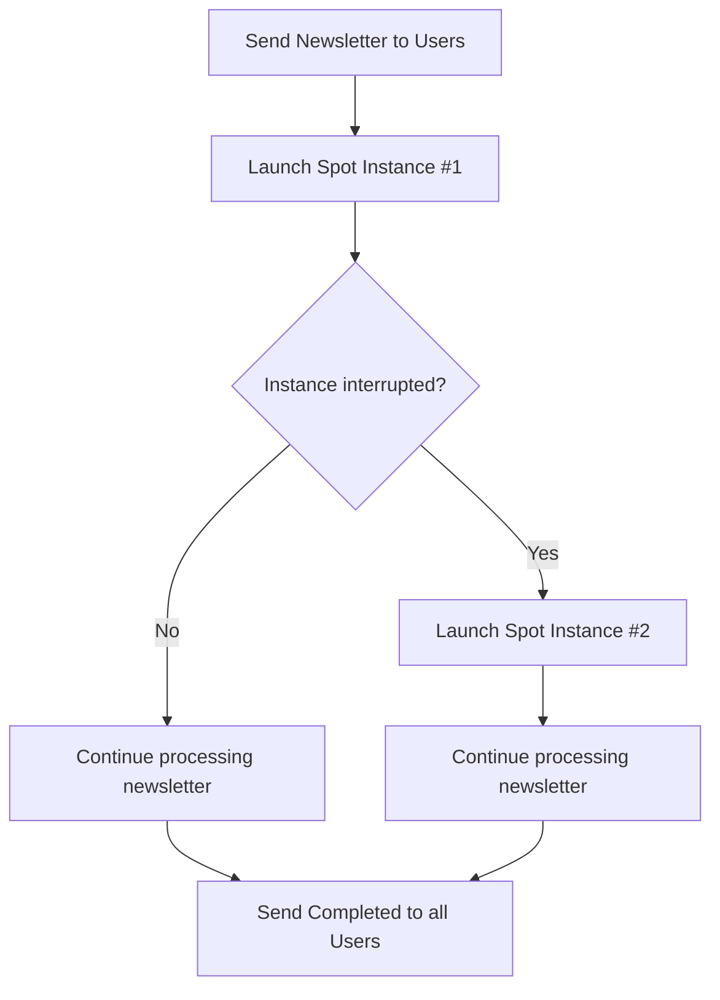

<!-- updated: 2026-07-08T07:41:31.000Z -->
## Batch Processing with AWS

- **Definition**: Batch processing involves executing non-critical tasks that don't require immediate results. These tasks are processed in bulk at scheduled intervals or as resources become available.
- **Use Cases**:
  - Sending notification emails for updates (e.g., order processing or promotional newsletters).
  - Generating reports or processing data offline.
  - Performing non-urgent tasks that can be completed over a flexible time period.
- **Instance Choice for Batch Jobs**:
  - Use **Spot Instances** since batch processing tasks are not time-sensitive and can tolerate interruptions.
  - If a spot instance is stopped, another spot instance can be launched to continue the task.
  - Prioritize cost efficiency for non-critical, repeatable jobs.

### Key Points
- Batch processing jobs like sending newsletters to a million users can tolerate delays and interruptions.
- Spot instances are a suitable choice for these jobs due to their cost-effectiveness.

> 🏢 **Real world**: Amazon sends non-urgent promotional emails to customers for upcoming sales using batch processing. The timing of these emails (1 PM or 3 PM) is not critical as long as all customers receive the message eventually. 

---

## AWS Tenancy Types

### Overview
AWS provides three tenancy options depending on requirements like resource exclusivity and compliance:
1. **Shared Tenancy**
2. **Dedicated Host**
3. **Dedicated Instance**

### Comparison Table

| Feature                | Shared Tenancy          | Dedicated Host               | Dedicated Instance          |
|------------------------|-------------------------|------------------------------|-----------------------------|
| **Hardware Access**    | Shared with others      | Exclusive                    | Exclusive                   |
| **IAM Accessibility**  | IAM allowed             | No IAM, root only            | IAM permitted with control |
| **Use Case**           | General-purpose         | Compliance (no sharing)      | Collaborative projects      |
| **Access Control**     | Root & IAM users share resources | Root only                 | Root decides permissions    |
| **Cost**               | Lower                  | Highest                     | Higher                      |

### Decision Examples
1. **Shared Tenancy**: Default and cost-effective. Ideal for general workloads without compliance requirements.
2. **Dedicated Host**: Root-only access. Best for highly secure or compliance-focused workloads, like military or social security systems.
3. **Dedicated Instance**: Collaboration environments where IAM users also need hardware access.

> 🏢 **Real world**: A government organization manages sensitive personal data, such as social security information. To comply with strict regulatory standards, they use a **Dedicated Host** to ensure exclusive hardware access and increased security.

---

## Spot Instances for Repeating Jobs

- **Definition**: Spot instances allow users to utilize unused compute capacity at a lower cost. However, they can be interrupted if capacity is reclaimed.
- **Optimal Usage**:
  - Suitable for repeatable/redundant tasks that are not time-sensitive.
  - Common use: batch processing jobs or working with large datasets (e.g., email broadcasts).
- **Interruption Handling**:
  - If a spot instance is interrupted, progress can be resumed using another spot instance.
  - Flexibility ensures that the overall task is completed eventually.

### Example Workflow for a Batch Newsletter Process:

> 🏢 **Real world**: A large e-commerce platform uses **Spot Instances** to send promotional emails to millions of customers. Even if some instances are interrupted, they spin up new ones to complete the process cost-effectively.
