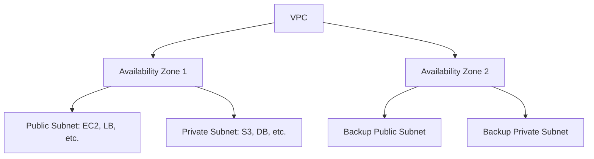
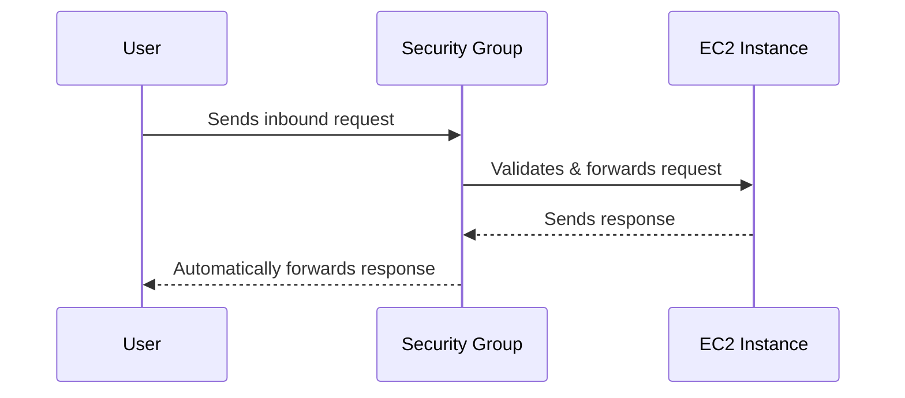
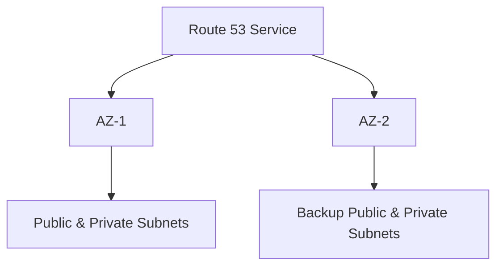

<!-- updated: 2026-07-08T07:41:43.000Z -->
## Topics Covered on 2026-06-15

---

## Internet Gateway (IGW)
- **Purpose**: Connects your AWS Virtual Private Cloud (VPC) to the internet.
- **Key Properties**:
  - Highly available and fault-tolerant.
  - Can scale horizontally to handle unlimited requests.
  - One VPC can have only one Internet Gateway attached.
  - Manual attachment to the VPC is required.
  - Not needed for private VPCs (used for internal requirements).

> 🏢 **Real world: Netflix**  
> Netflix uses Internet Gateways to connect their AWS-based architecture to the public internet, ensuring seamless global access to their streaming platform without concerns about downtimes or throttling.

---

## Virtual Private Cloud (VPC)
- **VPC** is regional in scope.
- **Subnets**: 
  - Always created in an Availability Zone (AZ), making them AZ-specific or "zonal."
  - Public Subnet: Contains compute services like EC2, Load Balancer, and Auto Scaling Group with internet access (via Internet Gateways).
  - Private Subnet: Holds backend systems like data storage services (e.g., S3, databases) without direct internet access.
- **IP Allocation in Subnets**:
  - A portion of VPC IP addresses is allocated to public subnets.
  - Private subnets are provided with separate IP ranges, keeping data storage secure.
  

> 🏢 **Real world: Puma**  
> Puma places their web front-end servers (like EC2 instances and load balancers) in public subnets and stores vital product data, including images and database information, in private subnets.

---

## Security Groups
- **Operates at**: Instance level.
- **Nature**: Stateful (remembers the state of connections).
  - Allows return traffic automatically without explicitly permitting outbound rules.
- **Rules**:
  - Only **Allow** rules are defined; all other traffic is implicitly denied.
- **Usage**: Validates requests to individual instances or resources.

> 🏢 **Real world: Dropbox**  
> Dropbox secures its instances using custom Security Group configurations that allow specific inbound and outbound traffic only from trusted IP addresses.

---

## Network Access Control List (NACL)
- **Operates at**: Subnet level.
- **Purpose**: Controls traffic in and out of a subnet.
- **Key Properties**:
  - Stateless: Each request is evaluated against the rules every time, both inbound and outbound.
  - Rules can **Allow** or **Deny** traffic explicitly.
  - Works best for broader control over entire subnets.
- **Comparison: Security Group vs. NACL**:

| Property                  | Security Group          | Network ACL                 |
|---------------------------|-------------------------|-----------------------------|
| **Level**                 | Instance               | Subnet                      |
| **Rules**                 | Only allows rules      | Explicit allow/deny         |
| **State**                 | Stateful               | Stateless                   |
| **Evaluation**            | All rules are evaluated| Rules are evaluated in order|

> 🏢 **Real world: Finance Apps**  
> A financial services app may use NACLs to restrict access to critical subnets hosting sensitive data but still allow public-facing servers to communicate with external APIs.

---

## Resiliency Using Availability Zones
- **Concept**: Use multiple Availability Zones to reduce risk from localized failures.
- **Strategies**:
  - Assign IP addresses across AZs so that a failure in one AZ does not affect all resources.
  - Reroute traffic automatically using Route 53 when an AZ goes down.
- **Example Architecture Overview**:
  - Distribute public and private subnets across AZs to ensure redundancy.
  - Each AZ manages specific resources, minimizing the scope of failures.

> 🏢 **Real world: Amazon**  
> Amazon maintains e-commerce availability globally by geographically distributing resources across AZs. If an AZ goes offline, Route 53 dynamically reroutes traffic to a redundant AZ.

---

## Round-Up Tasks
- Practice VPC, subnet creation, and IP address calculation on QA platforms.
- For tomorrow: Study NAT Gateway, Bastion Host, and VPC Peering.
