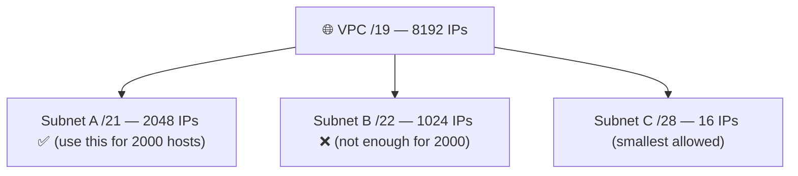
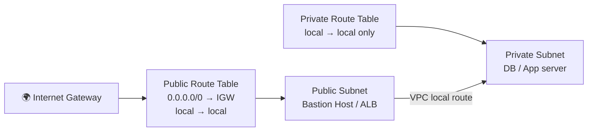
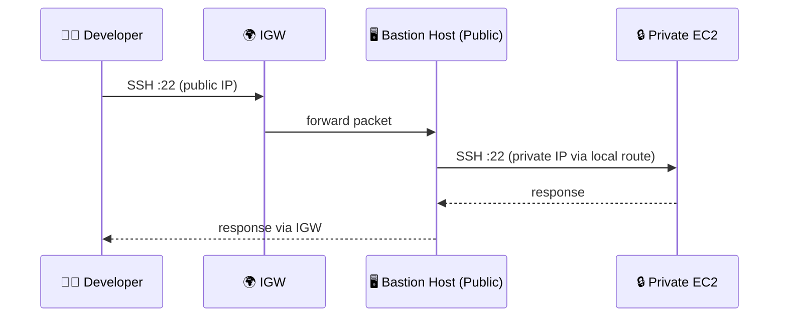
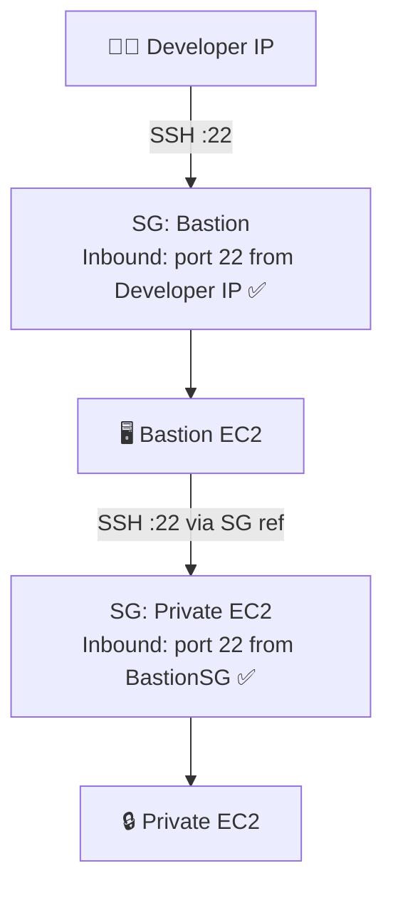
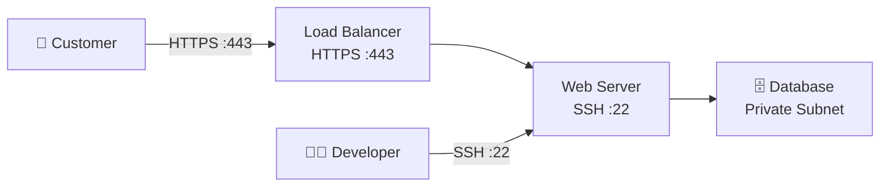

<!-- updated: 2026-06-16T09:54:35.707Z -->
# 🎙 Class Summary — 2026-06-16  ·  ✅ Class ended (~11:48)

_Topic of the day: VPC, CIDR, Route Tables, Internet Gateway, **Bastion Host & Security Groups**_

## 1. VPC, Subnets & CIDR
- Subnet IPs = **2^(32 − prefix)**; AWS reserves **5 IPs**/network; smallest = **/28 (16 IPs)**.
- Exercises: `/19` VPC → subnet must be /21 for 2000 hosts (not /22 — 1024 is not enough); always leave headroom; subnet < VPC.

> 🏢 **Real world:** Netflix runs separate VPCs per environment (prod, staging, dev). Inside the prod VPC they carve subnets like `/21` for streaming servers (needs thousands of IPs) and `/28` for tiny internal admin tools. Getting CIDR wrong means running out of IPs mid-scale and having to rebuild the network.

## 2. Route Tables → Public vs Private
- Public-subnet route table connects to **2 things**: **local** (internal VPC comms) + **`0.0.0.0/0` → Internet Gateway** (outside world).
- **Public subnet** = has the `0.0.0.0/0 → IGW` route; **private** = local only.

> 🏢 **Real world:** An e-commerce site (e.g. Zalando) puts its **load balancer and web servers in public subnets** (customers need to reach them). The **database and payment service go in private subnets** — no route to the internet means even if a hacker finds the IP, they can't connect. The route table is the only thing separating "public-facing" from "hidden".

## 3. 🔐 Bastion Host (Jump Box)
- Lets an external user **SSH into a private-subnet instance** without exposing it.
- It's **just an EC2 instance in the PUBLIC subnet** whose only job is **packet forwarding** — receives the incoming SSH request, forwards it to the private instance.
- ⭐ **Exam:** Bastion Host is **always placed in the PUBLIC subnet**.

> 🏢 **Real world:** A bank's developers need to patch a database server in a private subnet. They SSH into a hardened Bastion Host (public subnet, locked to the office IP range). From there they hop to the DB server. The DB is never directly reachable from the internet — the Bastion is the single controlled entry point, and every login is logged for compliance (PCI-DSS, SOC 2).

## 4. 🛡 Security Groups — KEY exam point
A security group does **two things**:
1. **Allow IP addresses / CIDRs** (acts as a firewall).
2. **Allow another security group** as a source (for internal data transfer).

- **Bastion SG:** allow **port 22 (SSH)** from the user's IP (or `0.0.0.0/0`).
- **Private instance SG:** must **allow the Bastion Host's security group** → only traffic via the Bastion is accepted.
- Empty/default SG = **no access**; you must add at least one allow rule.

> 🏢 **Real world:** Airbnb's app servers (SG: `app-sg`) need to talk to their RDS database. Instead of opening the DB to a CIDR range (which changes as servers scale), they set the DB security group inbound rule to **allow `app-sg`**. Now any new app server automatically gets DB access just by being in that security group — no IP management needed. This is how AWS-native apps scale without breaking their firewall rules.

## 5. SSH (22) vs HTTPS (443) — context
- Developers deploy/host via **SSH (22)**; customers load the **front-end over HTTPS (443)**.
- **Backend** (databases, payments, images) stays in the **private subnet**, hidden from the public.

> 🏢 **Real world:** When you open Spotify in your browser, your request hits their load balancer on **port 443 (HTTPS)**. Behind the scenes, Spotify's DevOps team SSHes into servers on **port 22** to deploy new code. The recommendation engine, billing system, and audio processing all run in private subnets — you as a customer only ever touch the public-facing layer.

---
## 📌 Homework & next session
- **QA exercise assigned: Bastion Host lab.** First do the basic setup (VPC, subnet, Internet Gateway, route tables) if not done — _then_ the Bastion Host lab.
- **Tomorrow (resumes 09:xx):** **MCQs** on VPC / Security Groups / Bastion Host → then new topic **NAT Gateway**.
- Questions → message Sharanya on **Slack**.

_Class stopped 15 min early; resumes tomorrow. (Sharanya also asked the group to message her on Slack if anyone knows why an absent classmate has been missing.)_
