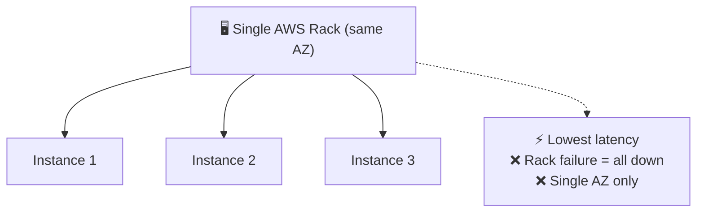
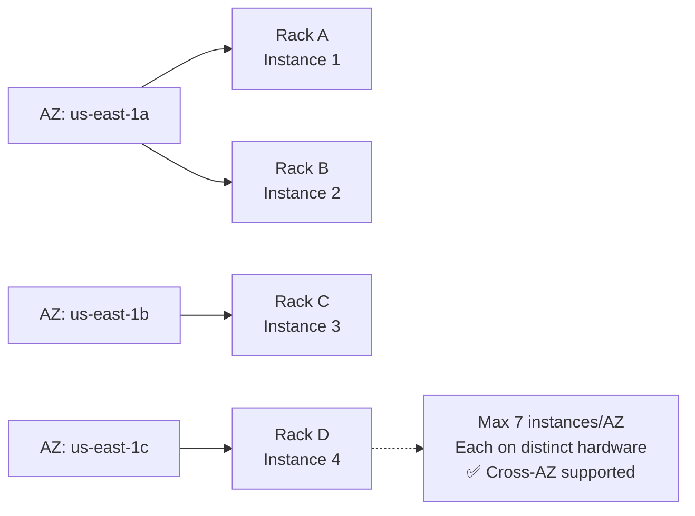
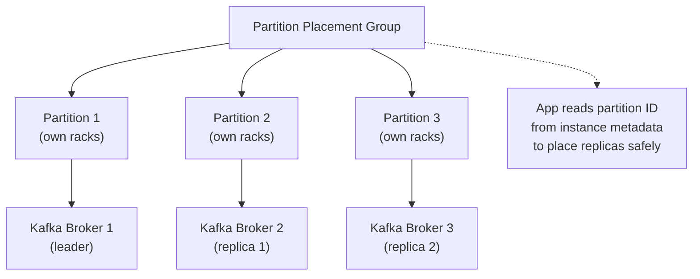
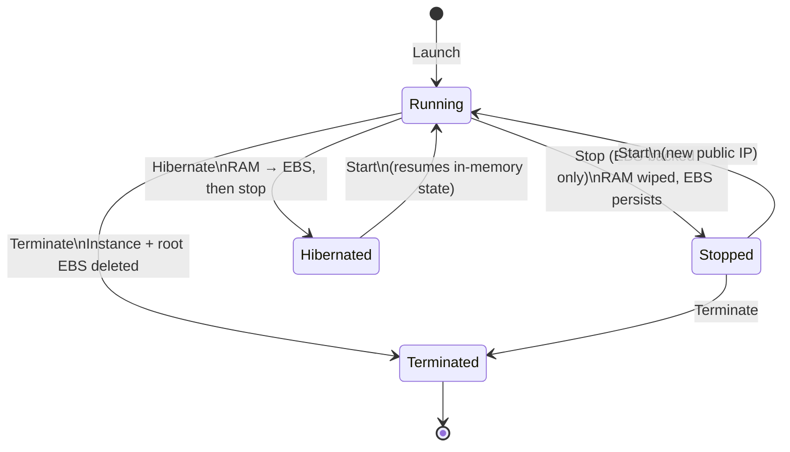
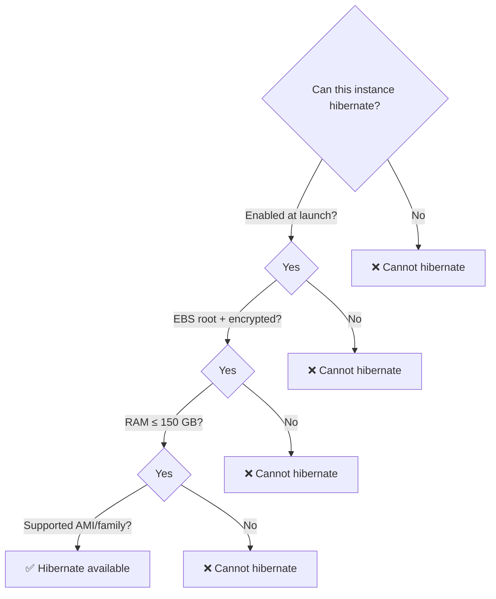

<!-- updated: 2026-06-17T10:00:00.000Z -->
# 🎙 Class Summary — 2026-06-17

_Topic of the day: **EC2 Placement Groups** & **Instance Lifecycle States**_

## 1. Placement Groups — Cluster
- All instances on the **same rack** in a single AZ → lowest latency, highest throughput between instances.
- Use for **HPC / tightly-coupled workloads**: MPI jobs, big data processing — instances talk to each other constantly.
- Tradeoff: one rack failure can **take out the whole group**; doesn't span AZs.

> 🏢 **Real world:** Renaissance Technologies runs massive parallel financial simulations where every millisecond of inter-node latency costs money. They use Cluster placement groups so their compute nodes share the same physical rack and can exchange results at near-wire speed — effectively turning many EC2 instances into one tightly coupled supercomputer.

## 2. Placement Groups — Spread
- Each instance on **separate hardware** (distinct rack, network, power source).
- Max **7 running instances per AZ** per group; can span multiple AZs.
- Use for a **small number of critical instances** — minimises chance one hardware failure takes down more than one.

> 🏢 **Real world:** Stripe runs 7 payment-processing nodes in a spread group across 3 AZs. If AWS has a rack failure in us-east-1a, at most one Stripe node is affected — the other 6 keep processing payments. For a payment company where downtime = lost transactions, hardware-level isolation is non-negotiable.

## 3. Placement Groups — Partition
- Divides the group into **logical partitions** (up to 7 per AZ), each backed by its **own set of racks**.
- AWS exposes **which partition each instance is in** via metadata — the app can use this to place replicas intelligently.
- Built for **partition-aware distributed systems**: HDFS, HBase, Cassandra, Kafka.

> 🏢 **Real world:** LinkedIn runs Kafka clusters on partition placement groups. Kafka replicates each message to 3 brokers — by placing leader + replicas in different partitions, LinkedIn ensures that a single rack failure never wipes out all copies of a message. The app reads the partition metadata from AWS and decides "don't put replica 2 in the same partition as replica 1."

## 4. Instance Lifecycle — Stop vs Hibernate vs Terminate
- **Stop** (EBS-backed only): OS shuts down, RAM wiped, EBS volumes persist. No compute charge; EBS still billed. New public IP on restart unless Elastic IP attached.
- **Hibernate**: RAM written to root EBS volume → on restart, OS resumes exactly where it left off (warm caches, in-flight processes). Much faster resume than cold boot.
- **Terminate**: Instance **permanently deleted**. Root EBS deleted too (unless `DeleteOnTermination=false`). No coming back — you launch a brand new instance.
- ⭐ **Exam trap:** Stop vs Terminate — stop preserves the instance ID and lets you restart; terminate destroys it forever.

> 🏢 **Real world:** Jupyter notebook servers on AWS (used by data science teams at Databricks) hibernate between sessions. A data scientist's notebook with 32 GB of loaded model weights doesn't have to re-load from S3 every morning — it hibernates overnight, resumes in seconds the next day. Without hibernate, that's 10+ minutes of cold-start every morning per data scientist.

## 5. Hibernate Prerequisites (exam checklist)
- Must be **enabled at launch** — cannot be turned on later.
- Root volume must be **EBS** and **encrypted**.
- Root volume must be **large enough** to hold RAM dump + signature.
- RAM capped at **150 GB**.
- Only specific **instance families** and **OS versions** (certain Amazon Linux, Ubuntu, Windows AMIs).
- **60-day limit** on continuous hibernation (AWS enforces this).

> 🏢 **Real world:** A quantitative trading firm pre-loads market data and ML models into RAM at 07:00. They hibernate instances at market close (16:30) and resume next morning — the 150 GB RAM limit is why they carefully size instance families. Exceeding it means no hibernate support and a cold-start penalty of 20+ minutes every trading day.

---
## 📌 Key exam facts
- **Cluster** = same rack, lowest latency, single AZ, whole group at risk from one failure.
- **Spread** = max 7/AZ, separate hardware per instance, cross-AZ ok — for critical small sets.
- **Partition** = up to 7 partitions/AZ, each partition has its own racks, app reads partition via metadata — for Kafka/HDFS/Cassandra.
- **Stop** = instance off, EBS survives, compute billing stops, public IP changes on restart.
- **Hibernate** = stop but RAM saved to EBS; resumes from exact state. Many prerequisites.
- **Terminate** = gone forever. Root EBS deleted unless `DeleteOnTermination=false`.
- Dedicated Host vs Dedicated Instance is **separate** from placement groups — don't confuse them.
