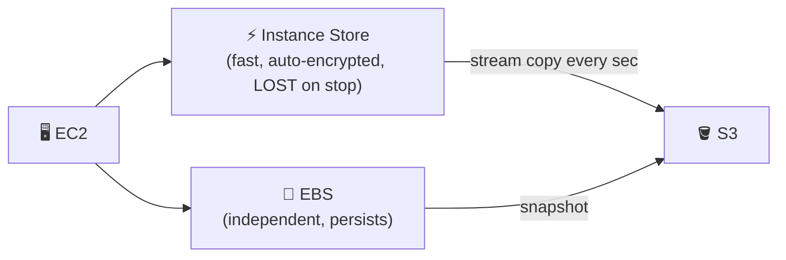
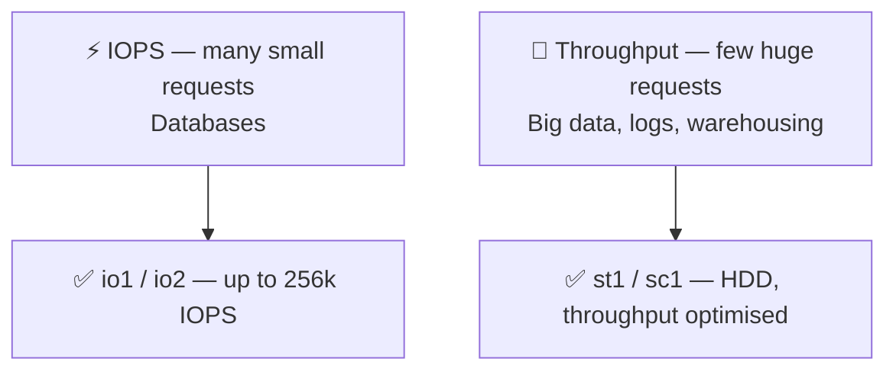
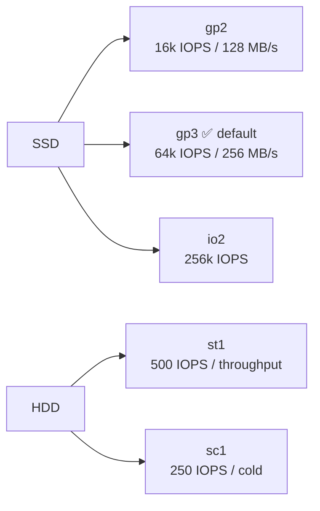
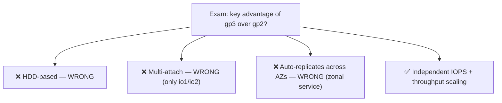
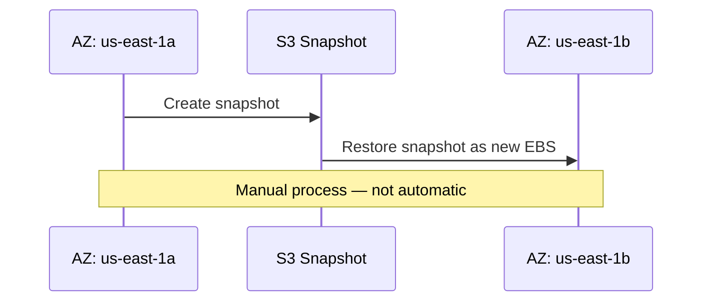
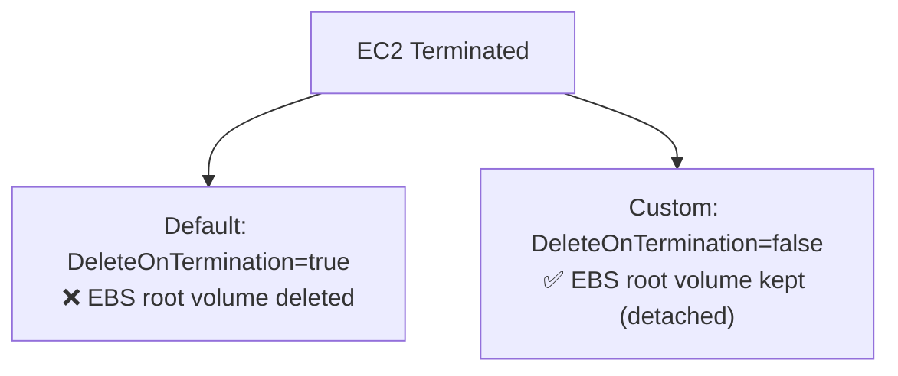

<!-- updated: 2026-06-19T08:12:33.138Z -->
# 🎙 Class Summary — 2026-06-19

_Topic of the day: **EBS Deep Dive** — Volume types, IOPS vs Throughput, EBS lifecycle, MCQ practice_

## 1. EBS vs Instance Store — Recap
- EBS is an **independent external storage** — unaffected by EC2 state (start/stop/hibernate/terminate).
- **Multi-attach** only works on **io1 and io2**. Not on gp2/gp3/Instance Store.
- **Instance Store backup** = stream-copy to S3 every second/minute while running. Stop = data gone.
- **EBS backup** = **Snapshot** (point-in-time copy, AWS manages it in S3).
- **Encryption**: Instance Store = auto-encrypted. EBS = optional.

> 🏢 **Real world:** Uber's driver-matching engine uses Instance Store for its in-memory location index (sub-millisecond lookups), streaming to S3 every 5 seconds. Failure → replacement loads from S3 within a minute.

## 2. IOPS vs Throughput
- **IOPS** = requests per second → many **small** requests (e.g. 1000 × 1 KB). → databases.
- **Throughput** = data volume per second (MB/s) → few **huge** requests (e.g. 1 × 100 TB). → big data, logs, warehousing.
- ⭐ Exam: question says "big data / logs / data warehousing" → **st1**. "Critical high-performance database" → **io2**.

> 🏢 **Real world:** Spotify uses io2 for their song metadata database (high IOPS, tiny queries) and st1 for audio file storage (high throughput, large sequential reads).

## 3. EBS Volume Types — Full Comparison
| Type | Kind | Max IOPS | Max Throughput | Use case |
|------|------|----------|----------------|----------|
| **sc1** | HDD Cold | 250 | 250 MB/s | Archived / cold data |
| **st1** | HDD Throughput | 500 | 500 MB/s | Big data, logs, warehousing |
| **gp2** | SSD General | 16,000 | 128 MB/s | Older gen, cheaper at low capacity |
| **gp3** | SSD General | 64,000 | 256 MB/s | Default choice, independent scaling |
| **io1/io2** | SSD Provisioned | 256,000 | 4,000 MB/s | Critical databases |

> 🏢 **Real world:** Netflix runs video log ingestion (5TB+/day) on st1, billing on io2, and general web servers on gp3.

## 4. gp2 vs gp3 — Exam traps
- Both are **SSD General Purpose** (not HDD) ❌
- gp3 does **NOT** multi-attach (only io1/io2 do) ❌
- EBS is a **zonal service** — locked to one AZ, does NOT auto-replicate across AZs ❌
- ✅ **Correct answer**: gp3 lets you **scale IOPS and throughput independently** of volume size.
- gp2 ties IOPS to volume size. gp3 decouples them — scale storage and performance separately.
- **Cost**: gp3 costs more when you need scaling capability. gp2 is cheaper at low/fixed capacity.

> 🏢 **Real world:** AWS migrated RDS default storage from gp2 → gp3 in 2023. gp3 cuts costs 20% and lets teams scale IOPS without buying extra storage they don't need.

## 5. EBS is a Zonal Service ⭐
- EBS is **always tied to one Availability Zone**.
- To move to another AZ: **take a snapshot → restore in the new AZ**.
- There is **no automatic replication** across AZs for EBS.
- ⭐ Exam trap: any answer saying "EBS automatically replicates across AZs" is **wrong**.

## 6. EBS Deletion on EC2 Terminate — Default Behaviour ⭐
- When you **terminate** an EC2 instance you get two options for the root EBS:
  - **Default (auto-selected)**: **Delete EBS** along with EC2.
  - **Custom**: **Detach EBS** — keeps the volume alive after termination.
- Most production setups use the custom option to preserve data.
- ⭐ Exam: "By default, what happens to the root EBS when EC2 is terminated?" → **It is deleted**.
- API term: `DeleteOnTermination=true` (default) vs `DeleteOnTermination=false` (custom).

> 🏢 **Real world:** A bank running compliance audit logs on EBS always sets `DeleteOnTermination=false` on their root volumes. Without it, a junior engineer accidentally terminating an instance would permanently destroy years of audit history.

## 7. AWS Certification Path
- **Cloud Practitioner**: foundational — generic EBS vs Instance Store questions.
- **Solutions Architect Associate**: deep on EBS variants, IOPS/Throughput, purchase options — today's content.
- **Solutions Architect Professional**: not in DCI scope, achievable after SAA.
- EBS volume type selection logic mirrors EC2 purchase options (Reserved/Spot/On-Demand) — conditions drive the choice.

---
## 📌 Class still in progress