<!-- updated: 2026-06-22T10:03:50.653Z -->
# 🎙 Class Summary — 2026-06-22

_Topic: **S3 Introduction + Hands-On** — EBS recap, Instance Store, Why S3, Object Storage, Latency, Serverless, Durability, Use Cases, Global vs Regional, Bucket Creation, Naming Rules, ACL, Block Public Access, Versioning, Tags, Encryption, ARN, Uploading Objects, Object URL & URI, S3 Folders, Deleting Buckets_

## 1. EBS Core Properties — Recap
- EBS is a **network-attached** block storage — connected to EC2 like a USB cable.
- **Zonal service**: EBS and EC2 must be in the **same Availability Zone**.
- EBS persists independently of EC2 state.

> 🏢 **Real world:** A bank sets `DeleteOnTermination=false` on EBS — without it, one accidental EC2 termination destroys years of audit data.

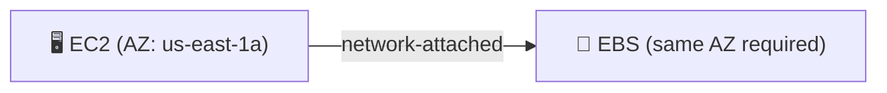
_💡 Remember: EBS never travels across AZs. If EC2 is in us-east-1a, EBS must also be in us-east-1a._

## 2. EBS Volume Types
| Type | Kind | Max IOPS | Max Storage | Use case |
|------|------|----------|-------------|----------|
| **gp2 / gp3** | SSD | 16k / 64k | 16 TB | Web servers, boot volumes |
| **io1 / io2** | SSD Provisioned | 256k | 256 TB | Critical databases |
| **st1** | HDD Throughput | 500 | 500 TB | Data warehousing |
| **sc1** | HDD Cold | 250 | — | Archive / rarely accessed |

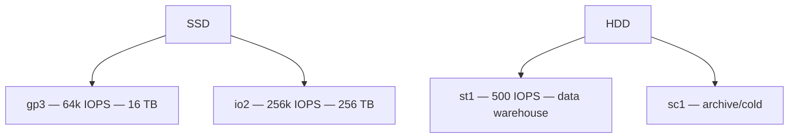
_💡 Remember: Exam says "database" → io2. "Big data / logs" → st1. gp3 is the safe default for everything else._

## 3. Instance Store
- Hardware-attached inside EC2. 30 GB free tier. Deleted on stop/terminate — always backup to S3.
- ⭐ Exam: cleared on stop OR terminate.

> 🏢 **Real world:** Uber's location index on Instance Store + S3 backup every 5 seconds.

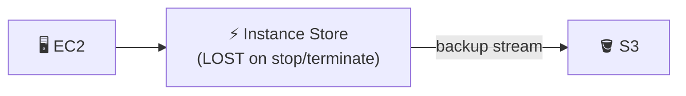
_💡 Remember: Instance Store = fastest but zero durability. Stop the machine = lose everything. Always stream to S3._

## 4. Why S3?
- EBS = zonal, can't serve global companies. S3 = regional, cross-AZ, cross-region, petabyte scale.

> 🏢 **Real world:** Netflix needs both us-east and us-west to access the same movies — impossible with EBS, S3 delivers.

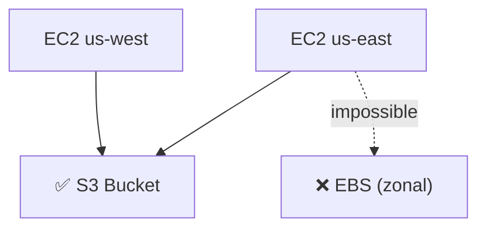
_💡 Remember: Multiple EC2s in different AZs or regions need the same data? → S3. EBS is a dead end for shared access._

## 5. S3 — Simple Storage Service
- **Regional service** — one bucket, all AZs + other regions.
- **Serverless** — no EC2, no OS. AWS manages everything internally.
- S3 is like Apple iCloud / Google Drive — internals not revealed.

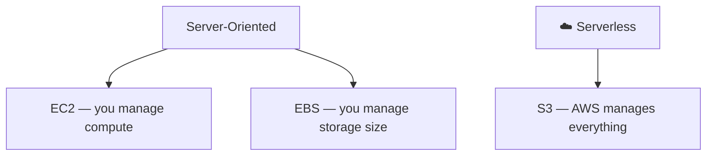
_💡 Remember: With EC2/EBS you manage servers. With S3 you manage only your data — AWS handles everything else._

## 6. Object Storage vs Block Storage ⭐
- **EBS (block)**: file split into chunks, EC2 OS reassembles. Requires OS. Cannot store two files with same name.
- **S3 (object)**: file stored intact as one **object** with metadata (uploader, time, size). Can store two files with same name — metadata distinguishes them.
- S3 ≠ database. S3 = dump space (dustbin) — throw in randomly, OR organize.

> 🏢 **Real world:** Spotify queries S3 metadata to track uploads without reading audio files.

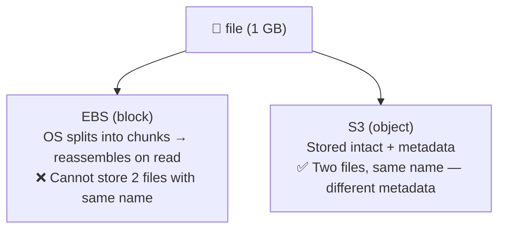
_💡 Remember: EBS uses your OS file system — same name = conflict. S3 uses metadata to tell versions apart, like Git._

## 7. Latency Comparison ⭐
| Storage | Network | Latency |
|---------|---------|--------|
| **Instance Store** | None (inside EC2) | Lowest |
| **EBS** | Short (same AZ — "1-foot USB cable") | Low |
| **S3** | Long (cross-AZ/cross-region — "miles of cable") | Higher |

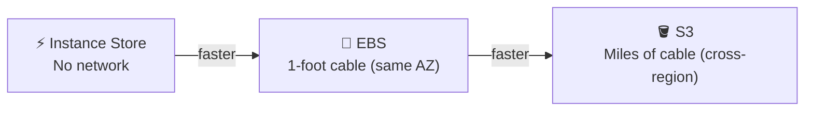
_💡 Remember: More network = more latency. Instance Store is inside the machine — zero cable._

## 8. Storage Capacity Comparison ⭐
| Service | Max Capacity | Who manages? |
|---------|-------------|---------------|
| Instance Store | ~30 GB free tier | AWS (built-in) |
| EBS gp3 | 16 TB | You |
| EBS io2 | 256 TB | You |
| EBS st1 | 500 TB | You |
| **S3** | **Unlimited** | **AWS** |

_💡 Remember: EBS you must declare size upfront. S3 you just create a bucket — no size limit ever._

## 9. S3 Durability ⭐
- **99.999999999%** durable (eleven 9s).
- Store **10 million files** → chance of losing **1 file** = once every **10,000 years**.

> 🏢 **Real world:** US National Archives stores documents in S3 — an object stored today will still exist in 2124.

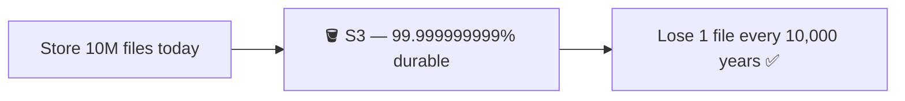
_💡 Remember: 11 nines = practically impossible to lose data. If AWS loses your S3 data, they get sued._

## 10. S3 Use Cases ⭐
- **All backups**: EBS snapshots, DB dumps, Instance Store backups
- **Disaster Recovery**: replicate across regions (US + Asia Pacific)
- **Data Lakes / Big Data / Archive / Hybrid cloud / Media / IoT / Static website hosting**

> 🏢 **Real world:** A global bank keeps transaction logs in us-east-1 AND ap-southeast-1. If US goes down, Asia Pacific takes over.

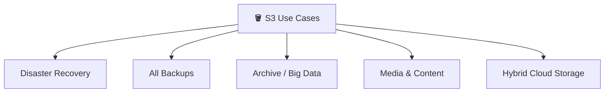
_💡 Remember: Any time the question mentions "backup", "cross-region copy", "unlimited data", or "no server needed" → S3._

## 11. S3 Global vs Regional — Exam Trap ⭐⭐
- **IAM = Global**: no data center — just users/permissions. Works from anywhere.
- **S3 = Regional**: must pick a region. But gives **global accessibility** once created.
- ⭐ Exam: **"S3 is a regional service that gives global accessibility."**

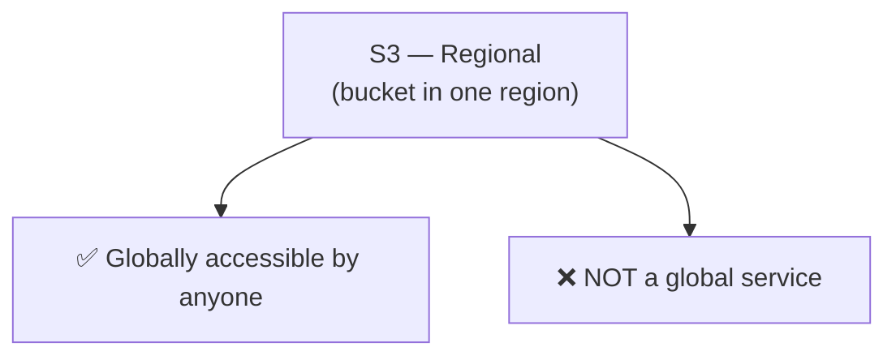
_💡 Remember: IAM has no data center → global. S3 NEEDS a data center → regional. But users worldwide can reach it._

## 12. S3 Bucket Naming Rules ⭐⭐
- **Globally unique** across all of AWS — not just your account or region.
- **3–63 characters**, **lowercase only**: `a-z`, `0-9`, `.`, `-` (only 2 special chars)
- Must **start and end with a letter** — no numbers as first or last character.
- ⭐ Exam: "Can bucket name be regionally unique?" → **No. Globally unique only.**

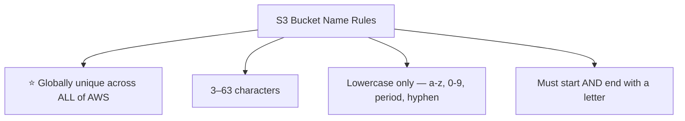
_💡 Remember: The name is global even though the bucket is regional. `my-bucket` is taken forever by whoever created it first._

## 13. S3 ACL & Block Public Access ⭐
- **ACL**: controls per-object access — like a firewall for storage. Default = **disabled**.
- **Block Public Access**: ⭐ **ON by default** — all buckets are private automatically.
- ⭐ CP exam: "Default state of S3 public access?" → **Blocked**.

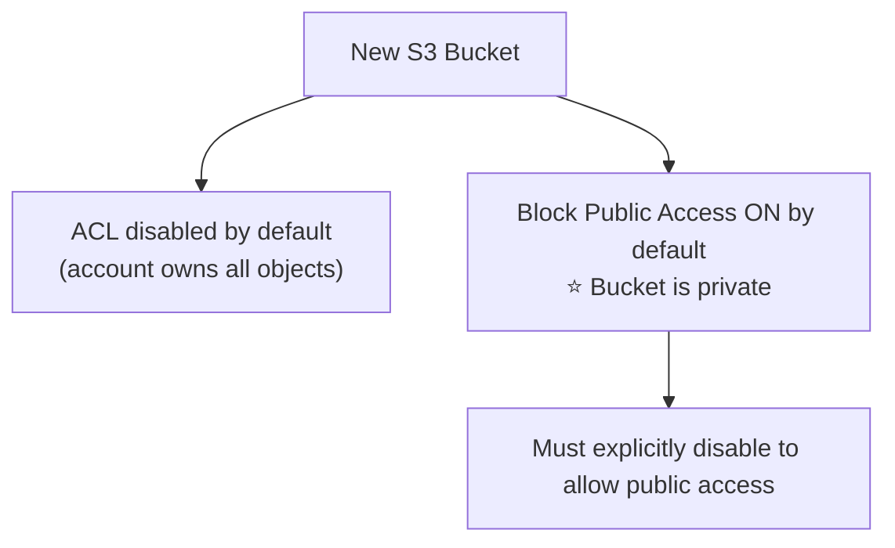
_💡 Remember: S3 is private by default. You have to actively open it up — protects from accidental data exposure._

## 14. S3 Versioning ⭐
- Keeps **multiple versions of the same object** — same filename, different metadata.
- S3 can store two files with same name; EBS/Instance Store cannot.
- Git analogy: S3 versioning = Git version control. GitHub = serverless cloud storage for code.
- Movie example: bad versions → private, good version → public.
- Disabled by default. Can enable anytime from bucket Properties tab.
- QA hands-on assigned. Full session: tomorrow or Friday.

> 🏢 **Real world:** Netflix uploads a new movie version after fixing audio. Old broken version made private — new version goes public via S3 versioning + permissions.

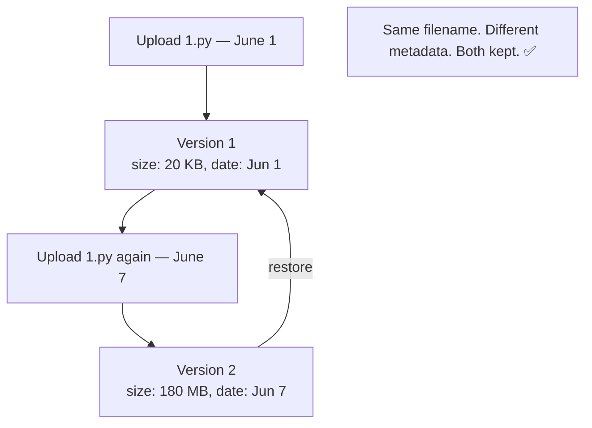
_💡 Remember: Versioning = Git for S3. Metadata is what makes same-named files distinguishable. Off by default — must enable._

## 15. S3 Tags & ARN ⭐
- **Tags**: up to **50 tags** per bucket — key-value identifiers only.
- VPC/EC2 names = just tags (duplicates allowed). **S3 bucket name = unique identifier = the ARN**.
- **S3 ARN**: `arn:aws:s3:::your-bucket-name` — bucket name embedded (human-readable).
- EC2/EBS ARNs = random unreadable IDs. S3 ARN = your actual bucket name.

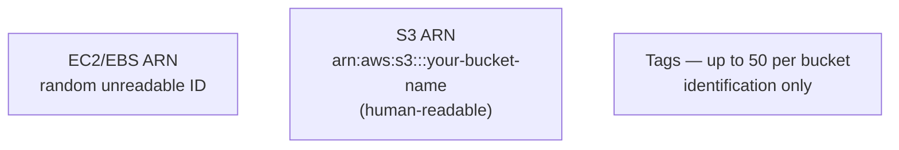
_💡 Remember: Two EBS can have the same name — identified by ID. Two S3 buckets CANNOT — the name IS the identifier._

## 16. S3 Encryption ⭐⭐⭐
- Three SSE types: **SSE-S3** (default, AWS manages keys) · **SSE-KMS** (KMS manages) · **SSE-C** (you manage).
- ⭐ Teacher: "1000 stars" — guaranteed Solutions Architect exam question.
- For now: **leave default (SSE-S3), don't change.** Full dedicated session coming.

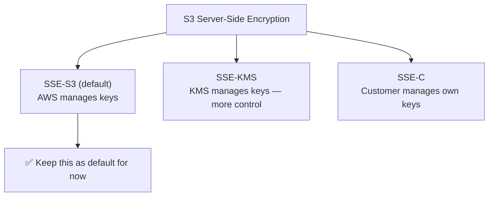
_💡 Remember: All three encrypt on the server side. The only difference = who holds the encryption keys._

## 17. S3 Object Details — Key, URI, URL ⭐
- After uploading, click the object name to see its details:
  - **Key** = the **file name** in S3. ⭐ Remember: in S3, "key" = file name.
  - **S3 URI** = `s3://bucket-name/filename` — Universal Resource Identifier. Uniquely identifies the file anywhere in AWS.
  - **Object URL** = `https://bucket-name.s3.eu-central-1.amazonaws.com/filename` — HTTPS link containing bucket name + region + file name.
  - **Owner**: account details of who uploaded it.
  - **Last modified, size, type**: all metadata stored with the object.
- ⭐ Object URL can be shared with anyone — but if **Block Public Access is ON** (default), they **cannot open it**.
- To view it yourself from the console: use the **Open** button (top right of object page) — this works regardless of public access settings.

> 🏢 **Real world:** A media company shares S3 Object URLs with CDN partners. Without disabling Block Public Access first, even a valid URL returns AccessDenied — a common gotcha.

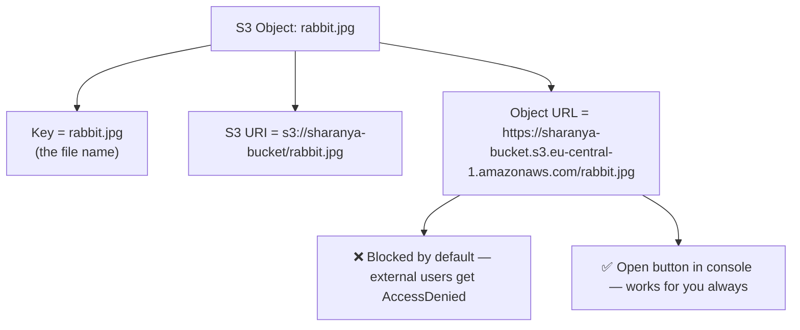
_💡 Remember: URL = HTTPS link (for browsers). URI = S3 path (for AWS services). Key = file name. Always use breadcrumb trail to navigate S3 bucket → objects._

## 18. S3 Folders — Organisation Inside a Bucket ⭐
- S3 buckets can be used as a **dump** (random) OR organised with **folders**.
- Create a folder: inside your bucket → **Create Folder** (top right) → give a name → keep encryption default → Create.
- Folder in S3 is identified by a **forward slash `/`** — just like Linux/terminal paths: `C:/Desktop/Test.py`.
- After creating the folder: click into it → Upload the same file inside → the **URI changes**:
  - Without folder: `s3://bucket-name/rabbit.jpg`
  - With folder: `s3://bucket-name/test-folder/rabbit.jpg`
- **Advantage of folders**: you can set **per-folder permissions** — control who can access files inside a specific folder. Fine-grained control without touching the whole bucket.
- You can view folder contents with the **Open** button just like root-level files.

> 🏢 **Real world:** A company stores user uploads in `s3://company-bucket/user-123/photos/` — folder-level IAM policies restrict each user to their own path only.

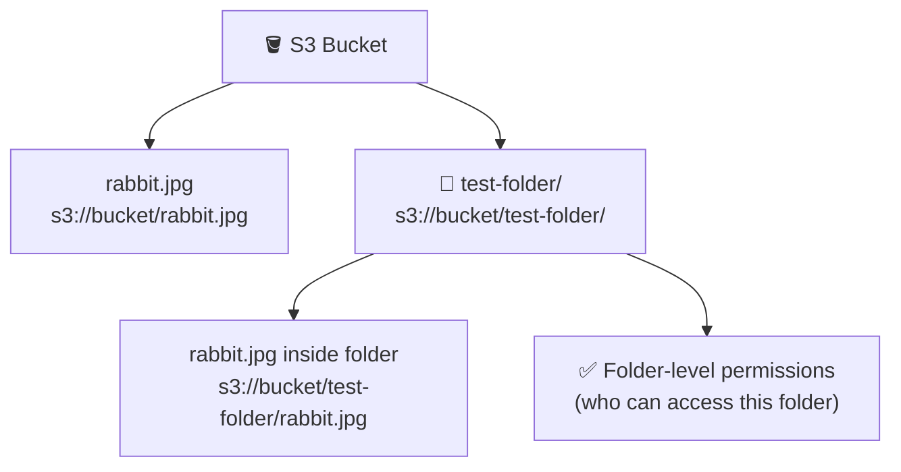
_💡 Remember: The `/` in S3 paths marks folders — just like Linux. URI updates to include folder path. Folders let you set granular access control per directory._

## 19. Deleting S3 Buckets — Empty First ⭐⭐
- S3 bucket has two options: **Empty** and **Delete**.
- ⭐ **Cannot delete a non-empty bucket** — you get an error if you try. Must **empty first**.
  - This is different from VPC: deleting a VPC immediately destroys all internal components (subnets, internet gateway, route tables).
  - S3 forces manual cleanup — AWS protects you from accidentally wiping all your data.
- **Empty bucket** process:
  1. Select bucket → click **Empty**
  2. Read the warning: emptying deletes ALL objects and **cannot be undone**
  3. Any objects added to the bucket while empty is in progress will also get deleted
  4. To block uploads during emptying: update the **bucket policy** to deny new writes
  5. Type `permanently delete` to confirm → click **Empty**
- **Delete order when emptying**: files are deleted first, then folders (you cannot delete a folder that still has files inside).
  - Example: bucket had rabbit.jpg (root) + test-folder/rabbit.jpg + test-folder → 3 objects deleted in order.
- After emptying: select bucket → **Delete** → confirm bucket name → bucket is gone permanently.
- ⭐ After deletion: the bucket name is **released globally** — any other AWS user can immediately re-create a bucket with that same name.

> 🏢 **Real world:** An ops engineer deleting a dev S3 bucket must follow: Empty → verify 0 objects → Delete. Skipping empty results in an AWS error blocking deletion — preventing accidental mass data loss.

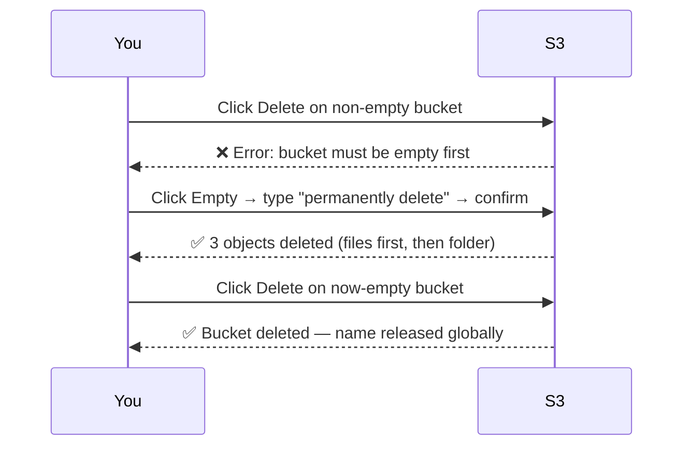
_💡 Remember: S3 delete = 2 steps: Empty then Delete. Unlike VPC (which deletes all children automatically), S3 protects you by forcing manual empty first._

---
## 📌 Coming up: S3 Storage Classes (5 types) · Cost optimization · Versioning (full) · Public access / static website hosting · S3 Encryption (full session)