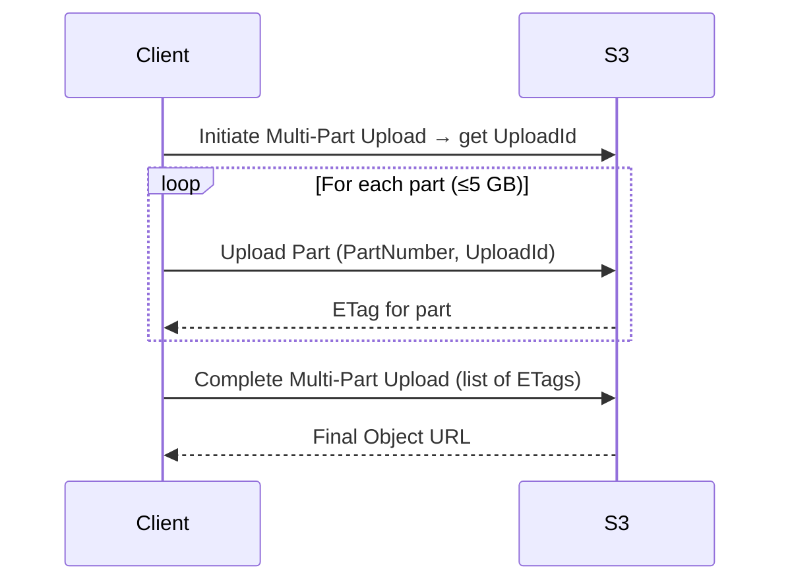
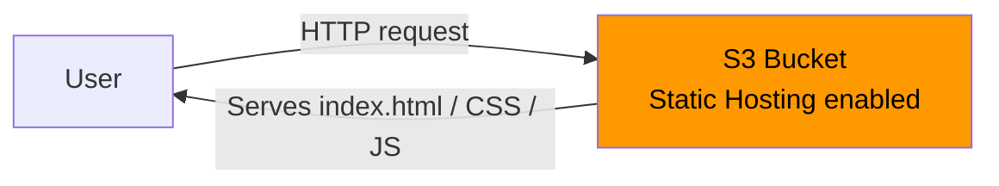
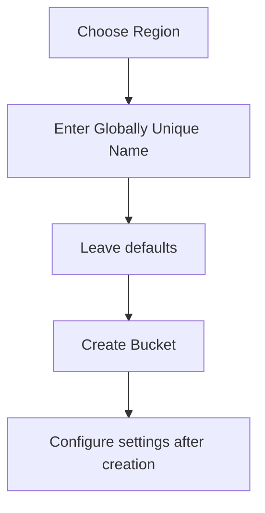
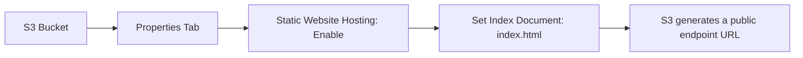
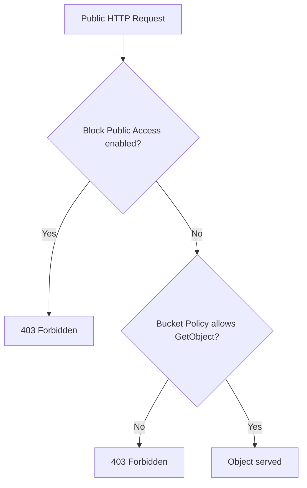
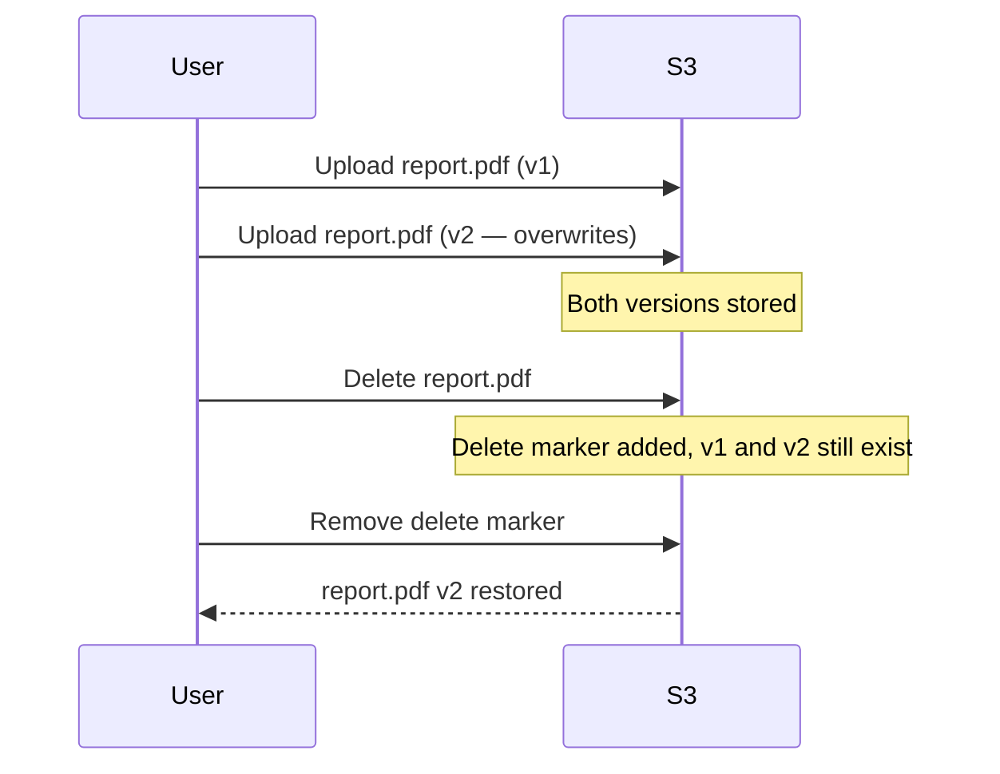
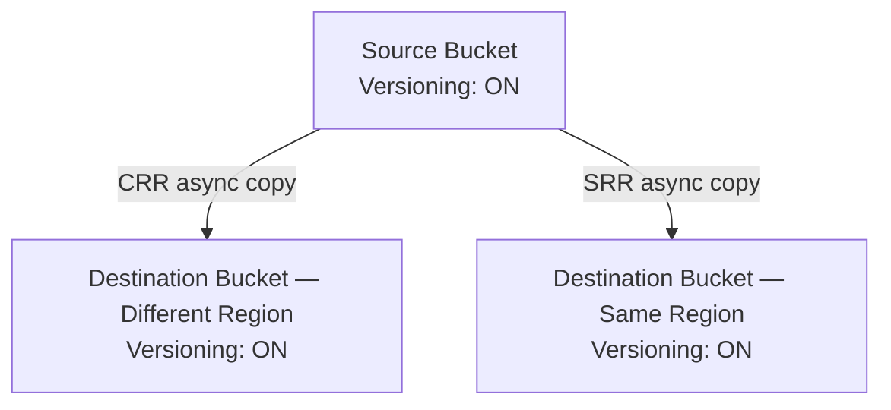

<!-- updated: 2026-06-23T13:42:00.000Z -->
## S3 Multi-Part Upload

- For files **larger than 5 GB**, you **must** use multi-part upload — single-part upload is not allowed
- Maximum single part size: **5 GB**; maximum object size in S3: **5 TB**
- Process: split the file into parts, upload each part with a sequential **part number**, then send a "complete" request to assemble them
- If one part fails, only that part needs to be re-uploaded — not the whole file
- AWS CLI and SDKs handle multi-part upload automatically for large files

> 🏢 **Real world:** Netflix uploads raw 4K film masters to S3 (often 100–300 GB per file). Because no single-part upload can exceed 5 GB, Netflix's ingest pipeline splits each file into 1 GB chunks, uploads them in parallel across multiple connections for speed, then assembles them — cutting a 300 GB upload time from hours to minutes by parallelising parts.

⚠️ **Exam tip:** File greater than 5 GB → **must** use multi-part upload. Max object size is 5 TB. Only failed parts need re-uploading.

---

## Static Website Hosting — Concept

- **Static websites** serve fixed HTML/CSS/JS files with no server-side processing
- **Dynamic websites** generate pages on the fly (databases, back-end logic)
- S3 can host static sites natively — no web server needed
- The AWS documentation site itself is an example of a static site hosted on S3 + CloudFront
- Students practiced by writing a simple `index.html` in VSCode and uploading it

> 🏢 **Real world:** Airbnb's marketing landing pages (blog posts, press releases, help articles) are pre-rendered as static HTML and served from S3 + CloudFront. Because these pages don't need live data, Airbnb saves server costs and gets instant global delivery with no backend at all.

---

## S3 Bucket Creation

- Bucket names are **globally unique** — no two buckets anywhere in AWS can share a name
- You select a **region** during creation; the bucket lives in that region
- Most settings (versioning, public access, encryption) are left at defaults during creation and configured afterward
- Naming rules: lowercase, no spaces, 3–63 characters

> 🏢 **Real world:** Spotify creates separate S3 buckets per region (e.g. `spotify-audio-eu-west-1`, `spotify-audio-us-east-1`) to store podcast and music files close to listeners. Because names must be globally unique, Spotify embeds the region in the bucket name as a convention.

⚠️ **Exam tip:** Bucket names are **always globally unique** — across all AWS accounts worldwide, not just your account.

---

## S3 Static Website Hosting (Enabling)

- Static website hosting is **disabled by default** — you must enable it manually
- Go to **Properties** tab → scroll to "Static website hosting" → Enable
- Set the **Index document** (e.g. `index.html`) — the file served when a user visits the root URL
- After enabling, AWS provides an endpoint URL (e.g. `http://<bucket>.s3-website-<region>.amazonaws.com`)

> 🏢 **Real world:** GitHub Pages works the same way under the hood — each repository's `gh-pages` branch content is served as static files from a storage bucket with an index document set to `index.html`. When you push to `gh-pages`, GitHub's pipeline uploads to their equivalent of S3 static hosting.

⚠️ **Exam tip:** Static hosting is **off by default**. You enable it under Properties, not Permissions.

---

## S3 Block Public Access vs Bucket Policy

- By default, S3 **blocks all public access** — even if you write a permissive bucket policy, Block Public Access overrides it
- To serve a static website publicly, you must:
  1. **Disable** "Block all public access" (under Permissions)
  2. Add a **Bucket Policy** (JSON) that allows `s3:GetObject` for `Principal: "*"` on `arn:aws:s3:::<bucket>/*`
- The `/*` in the ARN means **all objects** in the bucket
- `Principal: "*"` means **everyone** (anonymous public)

> 🏢 **Real world:** A bank running a public investor-relations page on S3 must disable Block Public Access only for that specific bucket, while keeping it enabled on every other bucket that holds customer data. This is why Block Public Access is a separate layer — it's a safety guardrail that prevents accidental public exposure of sensitive buckets.

⚠️ **Exam tip:** Block Public Access **overrides** bucket policies. You must disable it before a public bucket policy takes effect.

---

## S3 Versioning

- Versioning keeps **multiple copies** of every object — each upload creates a new version rather than overwriting
- **Disabled by default** — must be explicitly enabled on the bucket
- Deleting a versioned object adds a **delete marker** instead of permanently removing it
- You can **restore** a previous version by deleting the delete marker or copying an older version
- **Show Versions** toggle in the console reveals all versions and delete markers
- The **newest version** is shown by default; older versions are hidden unless you toggle "Show versions"
- Versioning can be **suspended** (no new versions created, old versions preserved) or **re-enabled**

> 🏢 **Real world:** Dropbox built its "version history" feature on top of S3 versioning. When a user accidentally overwrites a document, Dropbox retrieves the previous S3 version without needing a separate backup system. Enterprise plans allow version history going back 180 days.

⚠️ **Exam tip:** Deleting a versioned object creates a **delete marker** — the object is NOT permanently deleted. To truly delete, you must delete all versions individually.

---

## S3 Replication — CRR and SRR

- **Replication** automatically copies objects from a **source bucket** to one or more **destination buckets**
- **Cross-Region Replication (CRR)**: source and destination in **different AWS regions**
  - Use cases: compliance (data must exist in another country), lower latency for global users, disaster recovery
- **Same-Region Replication (SRR)**: source and destination in the **same region**
  - Use cases: aggregating logs from multiple buckets into one, keeping production and test environments in sync
- **Both require versioning to be enabled** on **both** source and destination buckets
- Replication is **asynchronous** — there is a short delay before new objects appear in the destination
- Bucket names are still globally unique — source and destination must have different names even for SRR

> 🏢 **Real world:** Zalando (EU e-commerce) uses S3 CRR to replicate product image buckets from `eu-central-1` (Frankfurt) to `us-east-1` (Virginia). European users upload images; US-based analytics jobs read replicated copies without cross-Atlantic latency. SRR replicates raw logs from 12 application buckets into a single `zalando-logs-aggregate` bucket for centralised processing.

⚠️ **Exam tip:** Replication requires versioning on **both** source and destination. CRR = different regions; SRR = same region. Replication is always **asynchronous**.

---
