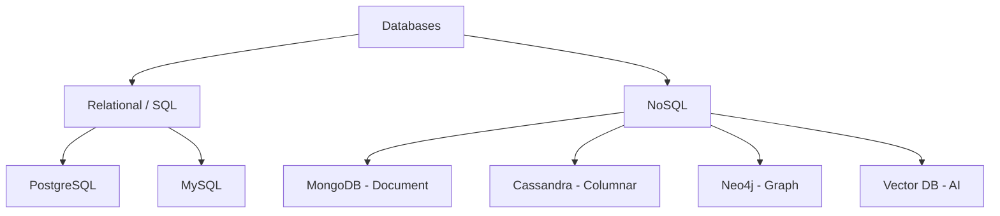
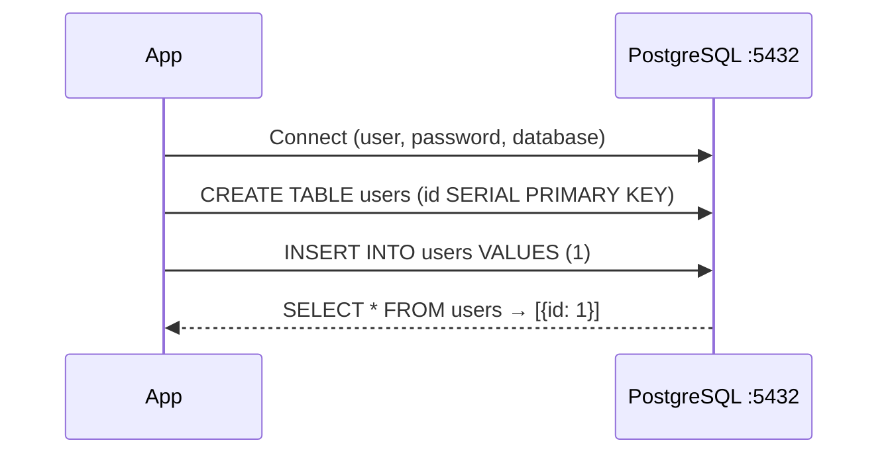
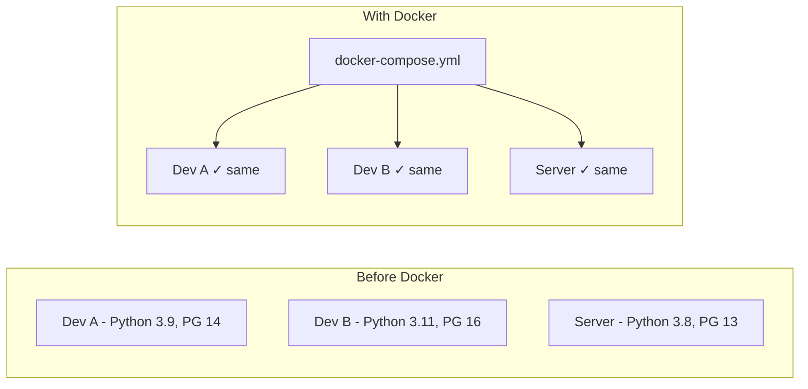
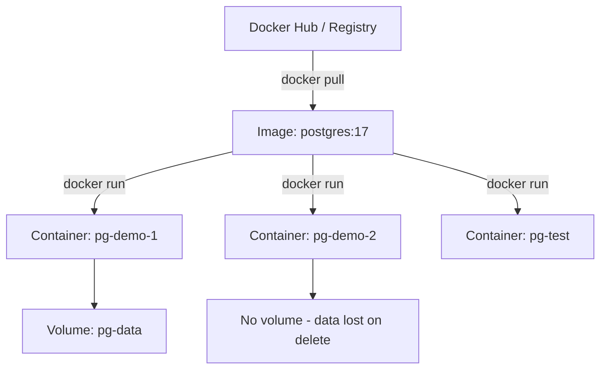
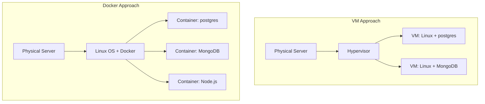
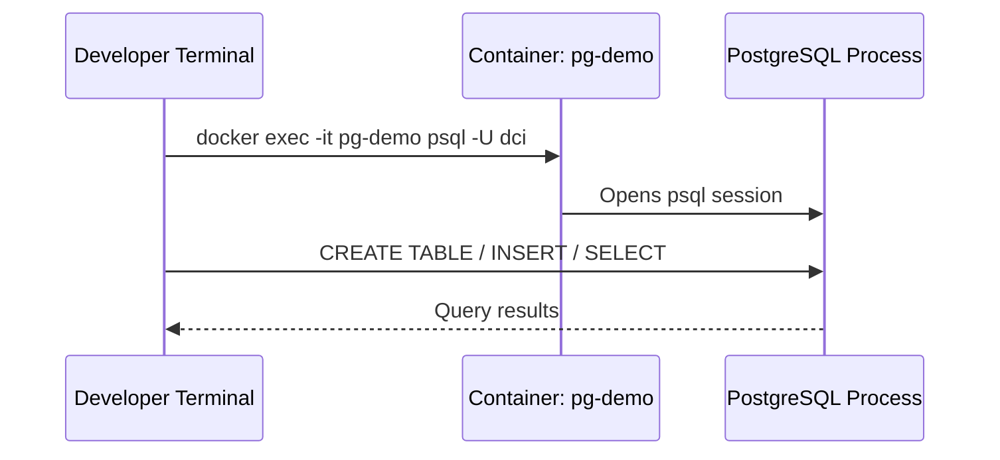
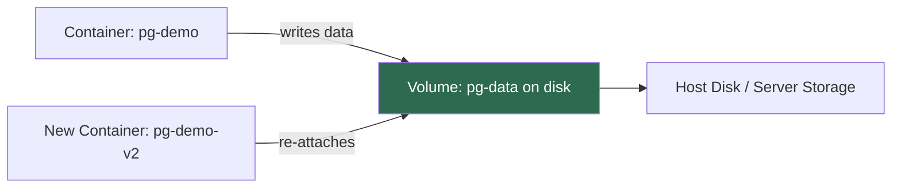

<!-- updated: 2026-06-24T09:20:49.727Z -->
## Why Databases Exist

- A database is an organised way to store and retrieve data persistently
- Without a database, data lives only in memory and is lost when the process stops
- Two main categories taught today: **relational** (SQL) and **NoSQL**
- Relational databases: PostgreSQL, MySQL — structured tables with a fixed schema, relationships between tables via foreign keys
- NoSQL databases: MongoDB (document), Cassandra (columnar), Neo4j (graph), vector databases (AI embeddings)
- The answer to "which database should I use?" is always **"it depends"** — on the data structure, access patterns, and team familiarity

> 🏢 **Real world:** Instagram started with PostgreSQL and MySQL for posts and user data, then added Cassandra as they scaled to handle billions of activity feed events that don't need rigid relational structure.



---

## PostgreSQL

- Open source relational database — most popular choice in the industry today
- Supports traditional relational tables with schemas AND schema-less JSON/JSONB columns — gives the best of both worlds
- Default port: **5432**
- Default image on Docker Hub: `postgres:17` (version 17 is current stable)
- Every postgres container requires at minimum: `POSTGRES_PASSWORD`, `POSTGRES_USER`, `POSTGRES_DB` environment variables

> 🏢 **Real world:** Shopify uses PostgreSQL as their primary database for merchant stores and orders, relying on its JSONB support to store flexible product metadata without needing a full schema migration every time merchants add custom fields.



---

## The Dependency Hell Problem — Why Docker Exists

- Classic developer problem: "it works on my machine" — code that runs fine on one developer's laptop breaks on another's
- Causes: different OS versions, different programming language versions, different library/dependency versions, different port configurations
- Before Docker, every developer had to manually install and configure every dependency — error-prone and not reproducible
- Windows vs Linux vs Mac differences made this especially painful (instructor: "please don't use Windows for programming environments")
- Docker solves this by letting the team share a single YAML configuration file (`docker-compose.yml`) — everyone gets the **same software, same version, same configuration**

> 🏢 **Real world:** Spotify engineering teams each maintain their own microservices. Before containerisation, onboarding a new developer could take days of environment setup. With Docker, a new hire runs one command and the entire local development stack is running in minutes.



---

## Docker: Image vs Container (The Two Most Important Keywords)

- **Image** — a specific software package at a specific version, stored as a reusable snapshot; examples: `postgres:17`, `mongodb:7`, `node:20`
  - Think of it as the blueprint/template — the software itself, not running yet
  - Images are stored in Docker Hub (the central registry)
  - Tags identify versions: `postgres:17` is stable; `postgres:latest` does NOT mean stable
- **Container** — the running environment where an image executes
  - One image can run in multiple containers simultaneously
  - A container has lifecycle states: created → running → stopped → removed
  - Deleting a container does NOT delete the image
  - Containers have their own internal storage by default (temporary — lost on deletion)

⚠️ **Exam tip:** The instructor emphasised these are "the two most important keywords" and stressed them multiple times. Image = software + version (blueprint). Container = the running environment. Never confuse them.

> 🏢 **Real world:** Netflix runs thousands of containers per service across their infrastructure. Each container is an instance of the same Docker image — they can spin up 500 new containers from a single image in seconds during traffic spikes, then tear them down just as fast.



---

## Docker Tags and "latest" Warning

- Docker Hub images have **tags** to identify versions — e.g. `postgres:17`, `postgres:trixie`, `postgres:latest`
- **`latest` does NOT mean stable** — it means the most recently pushed version, which could be a release candidate or beta
- `trixie` is a Debian codename tag — it indicates the underlying OS, not necessarily a stable release
- For production servers and live systems: **always pin to a specific stable version** (e.g. `postgres:17`)
- For local development/experimentation: latest is acceptable
- You can check available versions and their stability on Docker Hub before choosing

⚠️ **Exam tip:** The instructor explicitly warned: "latest does not mean stable and latest does not mean end of life support" — they highlighted this as a common misunderstanding.

---

## Docker vs Virtual Machine (VM)

- **Virtual Machine (VM)**:
  - Requires its own complete operating system (Linux or Windows Server)
  - Needs a hypervisor (guest OS) layer
  - One VM = one environment = one software
  - Heavyweight — slow to start, high resource usage
- **Docker Container**:
  - Shares the host OS kernel and processor — no separate OS needed
  - Lightweight, fast to start
  - Multiple containers can run on one Linux/Docker installation simultaneously
  - Example: you can run two separate `postgres` containers on one Linux machine with one Docker installation

> 🏢 **Real world:** AWS EC2 instances are VMs — each requires a full OS and hypervisor. AWS ECS/Fargate runs containers — the same physical server can run dozens of containerised microservices simultaneously, sharing the kernel, which is why containers are more cost-efficient at scale.



---

## Docker Hub and Registry

- **Registry** — a central location to store and share Docker images
- **Docker Hub** (`hub.docker.com`) is the default public registry — like GitHub but for Docker images
- Commands:
  - `docker pull postgres:17` — download an image from Docker Hub to local machine
  - `docker images postgres` — list all locally downloaded postgres images (shows size, creation date)
  - `docker push <username>/<image>:<tag>` — publish your own image to Docker Hub
- Images are versioned just like Git commits — `docker history postgres:17` shows what changed between layers

> 🏢 **Real world:** Companies like HashiCorp publish official images of Vault and Consul to Docker Hub. Teams pull these official images instead of downloading and configuring software manually — the image IS the reproducible installation.

---

## Docker CLI Commands

- `docker version` — show Docker version (instructor was running 29.5.3)
- `docker info` — show system info: how much memory and CPU is shared with Docker
- `docker images` — list all locally downloaded images
- `docker ps` — list all currently running containers
- `docker ps -a` — list all containers including stopped ones
- `docker pull <image>:<tag>` — download an image from Docker Hub
- `docker run --name <name> -e KEY=VAL -p <host>:<container> <image>` — create and start a new container
- `docker start <name>` — start an existing stopped container
- `docker stop <name>` — stop a running container
- `docker restart <name>` — restart a container
- `docker rm <name>` — remove/delete a container (data inside is lost if no volume)
- `docker history <image>` — show layer history of an image (like `git log`)

---

## Running a PostgreSQL Container: docker run

- Full command to create a postgres container:
  ```
  docker run --name pg-demo \
    -e POSTGRES_PASSWORD=mypassword \
    -e POSTGRES_USER=dci \
    -e POSTGRES_DB=dci_db \
    -p 5432:5432 \
    postgres:17
  ```
- Flags explained:
  - `--name pg-demo` — give the container a human-readable name
  - `-e` — pass environment variables required by the image (postgres requires password, user, db)
  - `-p 5432:5432` — map host port 5432 to container port 5432 (format: `host:container`)
  - `postgres:17` — the image to use
- Port format `left:right`: left = external port on your machine, right = internal port inside container
- Default ports: PostgreSQL = **5432**, MongoDB = **27017**
- Error "port already allocated" means another container is already using that port — stop the other container first
- Passwords must NEVER be hardcoded in production — use `.env` files or secrets management, never commit passwords to Git

> 🏢 **Real world:** In a real company setup, database passwords are stored in AWS Secrets Manager or HashiCorp Vault and injected at runtime — never as plaintext in source code or docker run commands.

---

## Container Lifecycle

- States a container goes through:
  1. **Created** — container defined but not yet started
  2. **Running** (Up) — image is executing inside the container
  3. **Stopped** — container paused, data still exists inside
  4. **Removed** — container deleted; all internal data lost unless a volume was used
- Docker Desktop UI and CLI commands are equivalent — every button in the UI executes the corresponding CLI command
- Sharing the YAML config means every developer just runs `docker start <container-name>` — no manual installation needed

---

## Accessing the Database Inside a Container: docker exec

- A running container is isolated — you can't just run `psql` from the outside
- `docker exec -it <container-name> <command>` — open an interactive terminal session inside the container
- To connect to the postgres database inside the container:
  ```
  docker exec -it pg-demo psql -U dci -d dci_db
  ```
- Once inside, you can run SQL:
  ```sql
  CREATE TABLE tci (id SERIAL PRIMARY KEY);
  INSERT INTO tci VALUES (1);
  SELECT * FROM tci;
  ```
- Important: in the psql interactive shell, statements must end with a **semicolon** (`;`)
- `exec` gives you access to any software running inside the container — Python, Node.js, psql, mongo shell, etc.

> 🏢 **Real world:** Site Reliability Engineers at large companies use `docker exec` to inspect production containers for debugging — checking logs, running diagnostics, or querying the database — without restarting the service.



---

## Docker Volumes: Persistent Storage

- By default, a container has **temporary internal storage** — all data is lost when the container is deleted
- A **volume** is an optional persistent storage location on the host disk, connected to the container
- Volumes are **mandatory for databases in real projects** — without a volume, deleting the container permanently destroys all database data
- Volume commands:
  - `docker volume create pg-data` — create a named volume
  - To mount a volume when running a container: add `-v pg-data:/var/lib/postgresql/data` to `docker run`
  - The `-v` flag format: `volume-name:container-mount-path`
- The mount path is a relative path on the host disk — if on a server via SSH, the data is on the server, not your laptop
- If you delete a container but kept the volume, you can create a new container and re-attach the same volume — data survives

> 🏢 **Real world:** A bank running PostgreSQL in Docker on AWS would always use volumes backed by EBS — so if a container crashes or needs to be replaced during a deployment, all customer transaction data persists and the new container reattaches to the existing volume.



⚠️ **Exam tip:** Volumes are **optional** but highly recommended for databases. Without a volume: data is ephemeral — deleting the container loses all data forever. With a volume: data persists independently of the container lifecycle.
