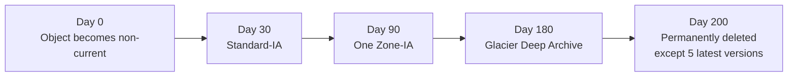
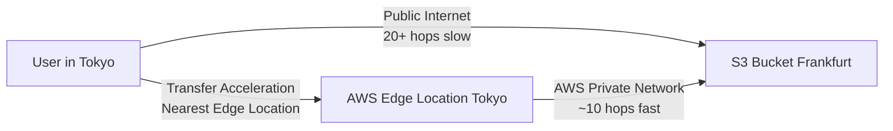
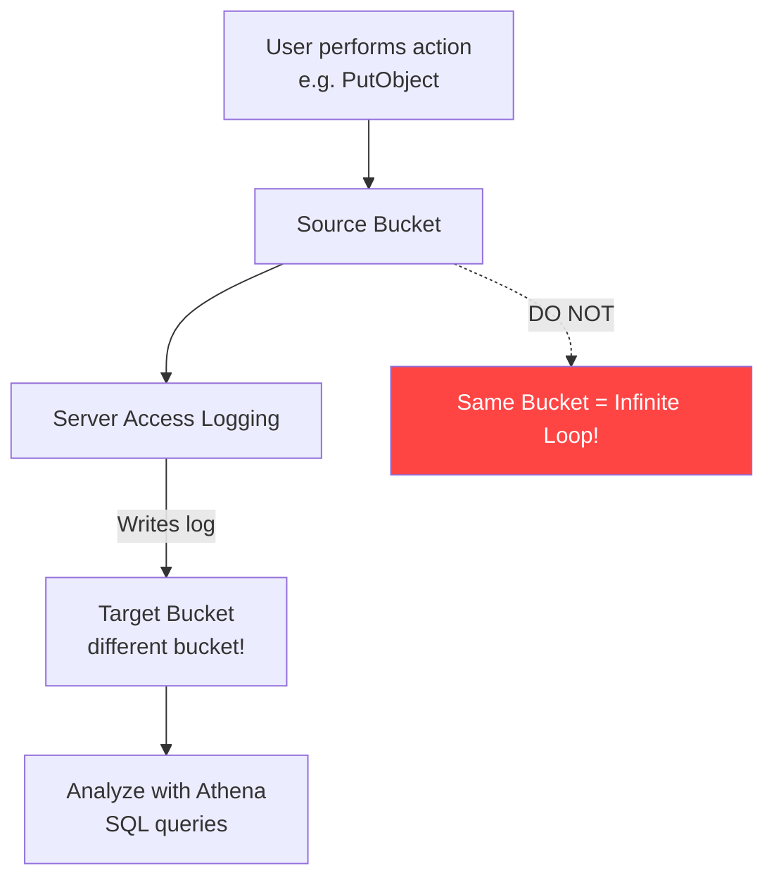

<!-- updated: 2026-06-25T12:00:00.000Z -->
## S3 Lifecycle Rules

- Lifecycle rules automate transitioning objects between storage classes and deleting them, based on age
- **Minimum 30-day rule**: You cannot transition from Standard to Standard-IA before 30 days — AWS will still charge you for 30 days of Standard storage even if you set fewer days
- **One Zone-IA** stores data in a single availability zone — 20% cheaper than Standard-IA, but only for data that can be regenerated; after choosing One Zone-IA, Glacier Instant Retrieval becomes disabled (data already compressed to one AZ)
- **Glacier Deep Archive** = cheapest storage class; retrieval: Standard 12 hours, Bulk 48 hours; minimum storage duration 180 days; for data kept 7–10 years
- You can set rules to **permanently delete non-current versions** after N days, while **retaining the latest N versions** (e.g. keep 5 newest non-current versions, delete the rest after 200 days)
- **Multiple rules per bucket** are supported — useful when different file types need different lifecycles (e.g. MP4 → Standard-IA after 90 days, PDF → after 100 days) or when current vs non-current versions need separate rules
- Lifecycle timeline example from class:
  - Day 0: object becomes non-current (new version uploaded)
  - Day 30: transition non-current to Standard-IA
  - Day 90: transition to One Zone-IA
  - Day 180: transition to Glacier Deep Archive
  - Day 200: permanently delete; retain 5 latest non-current versions

> 🏢 **Real world:** Netflix stores raw 4K film masters and production assets in S3. Assets actively in production stay in Standard; once a show wraps, files move to Standard-IA after 30 days (accessed occasionally for re-edits), then Glacier Deep Archive after 180 days for long-term compliance archival — automatically, with zero manual intervention, cutting storage costs by ~90%.

⚠️ **Exam tip:** Scenario-based questions — if data is *infrequently accessed*, *budget-tight*, and *can be regenerated*, the answer is **One Zone-IA**. Always check for those two signals: infrequent access + regenerable data.

---

## S3 Transfer Acceleration

- Solves the problem of slow upload speeds when users are geographically far from the S3 bucket (e.g. uploading from Japan to a bucket in Frankfurt)
- **Without Transfer Acceleration**: data travels over the public Internet through uncontrolled hops (could be 20+ hops) — AWS has no control over routing
- **With Transfer Acceleration**: data enters the **nearest AWS Edge Location**, then travels over AWS's private internal network to the bucket — AWS controls the routing and minimises hops (could drop from 20 to 10)
- Claims **up to 300% faster** upload speeds
- Costs a small additional fee per GB uploaded — optional, only worth enabling if you have users uploading large amounts of data from far-away regions
- To enable: S3 bucket → Properties → Transfer Acceleration → Edit → Enable → Save
- Once enabled, an **accelerated endpoint** is created (URL changes slightly) — from the user's perspective there is no functional difference; behind the scenes uploads route through Edge Locations
- Analogy used in class: normal Internet = driving in city traffic with jams and turns; Transfer Acceleration = a private congestion-free highway (like a toll road — you pay, you go faster)

> 🏢 **Real world:** Dropbox stores user files on S3. Their users are worldwide — someone in Tokyo uploading a 2 GB video to a bucket in us-east-1 would experience terrible speeds on public Internet. Dropbox enables Transfer Acceleration so the upload hits the nearest AWS Edge Location in Tokyo, then rides AWS's backbone to Virginia — cutting upload time from minutes to seconds and dramatically improving user experience for large file uploads.

---

## S3 Server Access Logging

- Records every API action performed on a bucket and its objects as log entries
- API actions include: `PutObject`, `GetObject`, `DeleteObject`, `ListObjects`, `ListObjectVersions`, `CreateBucket`, etc.
- Log entries contain: requester identity, bucket name, request timestamp, action performed, response status, object key, bytes transferred
- Use cases: security auditing, compliance tracking, access pattern analysis, troubleshooting unauthorised access
- Logs are stored in **a separate target bucket** (critical — see below), in text format; can be analysed with **Amazon Athena** using standard SQL
- Delivery is **not real-time** — logs may take a few minutes to appear
- **Must be explicitly enabled** on the source bucket; disabled by default

> ⚠️ **Critical mistake to avoid**: Never store logs in the same bucket being monitored. This causes an **infinite recursive loop** — a PutObject generates a log, the log is a PutObject, which generates another log, which is another PutObject… indefinitely. Storage costs explode. Always use a **separate destination bucket**.

> 🏢 **Real world:** A fintech company like Stripe stores transaction evidence files in S3 and must prove to auditors exactly who accessed what and when. They enable Server Access Logging on their compliance buckets, shipping logs to a separate locked-down archive bucket. Athena queries across millions of log entries let their security team detect any unusual access patterns (e.g. a contractor downloading files outside business hours) within minutes.

⚠️ **Exam tip:** Rohan explicitly flagged this as exam-important: logs **must** go to a **separate bucket** — storing them in the same monitored bucket causes recursive logging and exploding costs. Also: Server Access Logging is important from an **exam perspective** even though it's not heavily used in practice.

---
