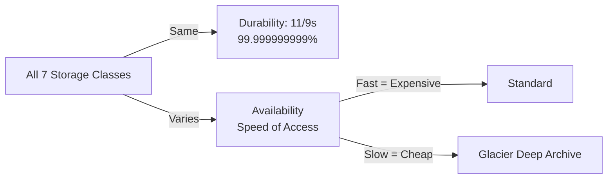
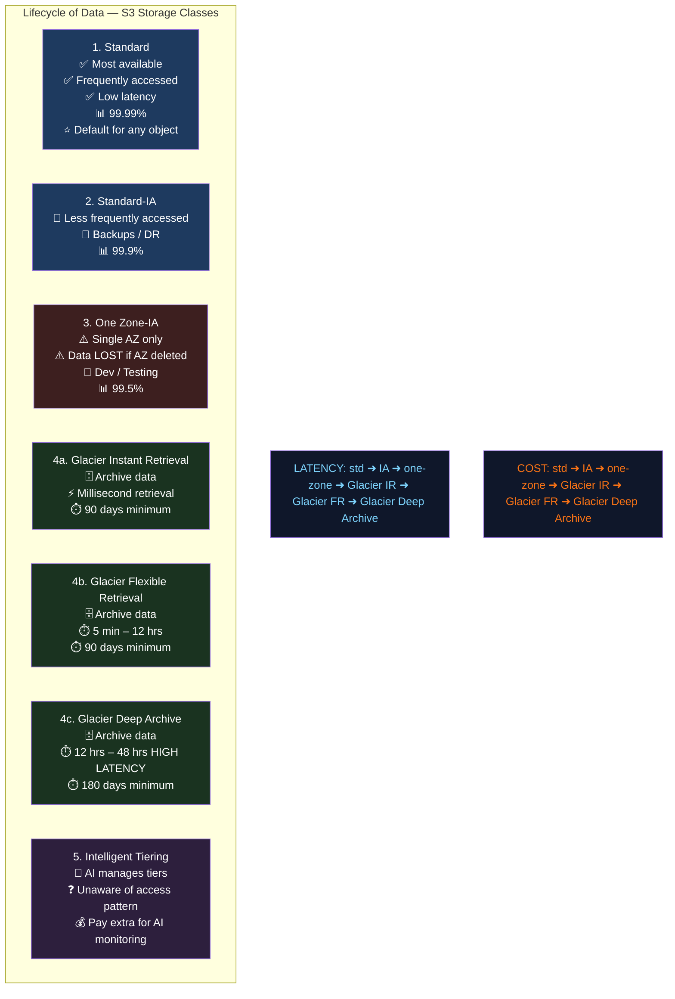
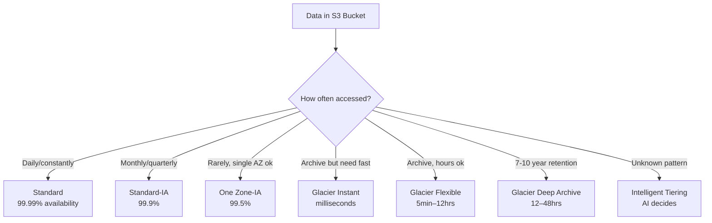
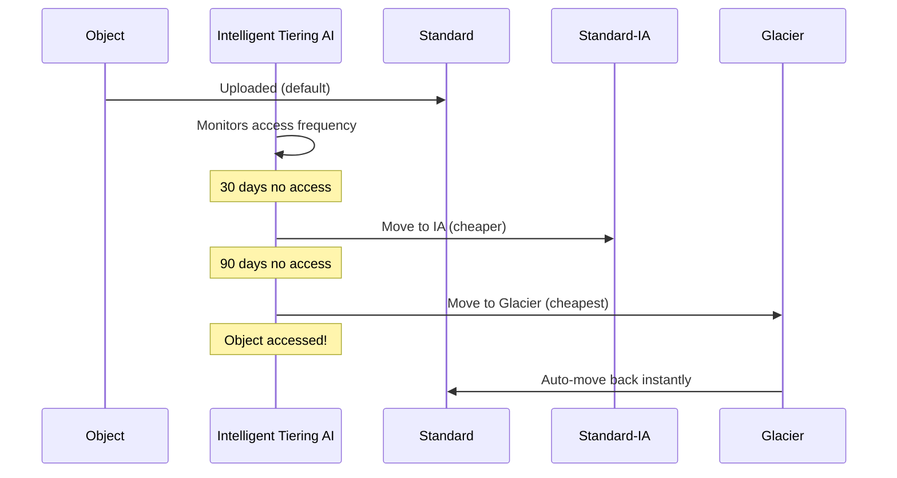

<!-- updated: 2026-06-26T10:00:00.000Z -->
## S3 Durability vs Availability

- **Durability** = will your data exist / not be lost? → **11 nines (99.999999999%)** — constant across ALL 7 storage classes, no exceptions
  - In practice: storing data for 10,000 years, you might lose 1 file — effectively zero data loss
  - **Data integrity** = the data you retrieve is byte-for-byte identical to what you stored
- **Availability** = how fast/readily can you access the data? → this is what differs between classes
  - Availability = "readiness" — how quickly does the class respond when you request data
  - Higher availability = higher cost; lower availability = lower cost
- **Key exam rule**: durability is always the same; availability and cost vary by class

> 🏢 **Real world:** Netflix stores movies in S3. A currently trending movie lives in Standard (instant access). An old movie from 2005 rarely watched lives in Glacier (hours to retrieve). Same durability — Netflix won't lose either file — but very different availability and cost.

---

## S3 Storage Classes — All 7 Types

| Class | Availability | Use Case | Min Storage |
|---|---|---|---|
| Standard | 99.99% | Frequently accessed, default | None |
| Standard-IA | 99.9% | Infrequent access, backups, DR | 30 days |
| One Zone-IA | 99.5% | Infrequent, single AZ, regenerable data | 30 days |
| Glacier Instant Retrieval | 99.9% | Archive, millisecond retrieval | 90 days |
| Glacier Flexible Retrieval | 99.99% | Archive, 5 min–12 hrs retrieval | 90 days |
| Glacier Deep Archive | 99.99% | Long-term archive 7–10 yrs, 12–48 hrs | 180 days |
| Intelligent Tiering | 99.9% | Unknown/changing access patterns | None |

**Latency order** (fastest → slowest):
`Standard < IA < One Zone-IA < Glacier IR < Glacier FR < Glacier Deep Archive`

**Cost order** (most expensive → cheapest):
`Standard > IA > One Zone-IA > Glacier IR > Glacier FR > Glacier Deep Archive`

- **One Zone-IA**: data stored in only 1 AZ — if that AZ goes down, data is lost; use only for data that can be regenerated; 99.5% availability; 20% cheaper than Standard-IA
- **Glacier Instant Retrieval**: millisecond access despite being archive — best of both worlds but costs more than Flexible
- **Glacier Flexible Retrieval**: 5 min (expedited), standard 3–5 hrs, bulk 5–12 hrs
- **Glacier Deep Archive**: cheapest of all; standard 12 hrs, bulk 48 hrs; minimum 180 days storage
- You pay for **storage + access** on all 6 standard classes

> 🏢 **Real world:** Airbnb stores listing photos (Standard — accessed constantly by users), booking records older than 2 years (Standard-IA — accessed occasionally for disputes), financial compliance records (Glacier Deep Archive — kept 7+ years, rarely accessed, cheapest possible storage). One company, three classes, dramatically different costs.

⚠️ **Exam tip:** Sharanya explicitly flagged: **durability is constant (11/9) across ALL classes — only availability changes**. Also: cost is determined by availability — faster access = more expensive. Scenario questions will describe access frequency and budget constraints; map them to the right class.

---

## S3 Intelligent Tiering

- Designed for data with **unknown or unpredictable access patterns**
- AI/ML continuously monitors access frequency of each object
- Automatically moves objects between tiers without you writing any lifecycle rules:
  - Frequently accessed → Standard tier
  - Not accessed for 30 days → moves to IA tier automatically
  - Not accessed for 90 days → moves to Glacier automatically
- You pay a **small monitoring fee** per object on top of storage costs (the "AI fee")
- Unlike other classes: you do **not pay for access/retrieval** — only storage + monitoring fee
- Best for: large datasets where you don't know which files will be accessed when

> 🏢 **Real world:** Spotify stores hundreds of millions of user-generated playlists and old podcast episodes in S3 with Intelligent Tiering. A playlist from 2018 that suddenly goes viral gets automatically moved back to Standard. A newly uploaded podcast that nobody listens to after 30 days automatically drops to IA. Spotify pays zero per-retrieval fees and zero engineering time managing lifecycle rules.

⚠️ **Exam tip:** Intelligent Tiering = "unaware of accessibility" — you don't know the pattern, AI figures it out. Key difference from other classes: **no retrieval fee**, but you pay extra monitoring cost per object.

---
