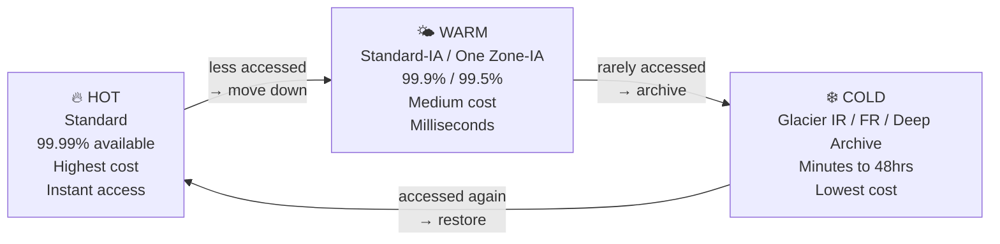
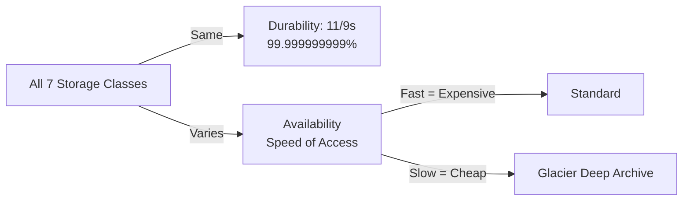
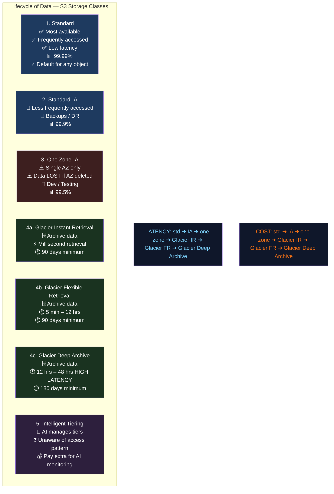
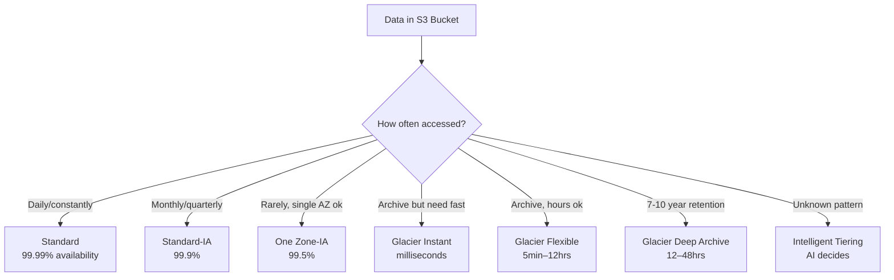
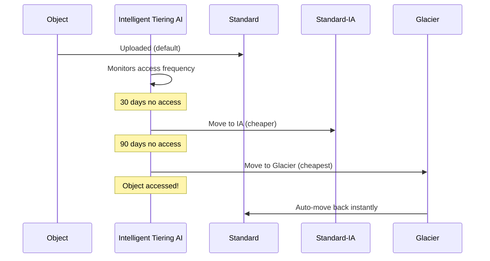
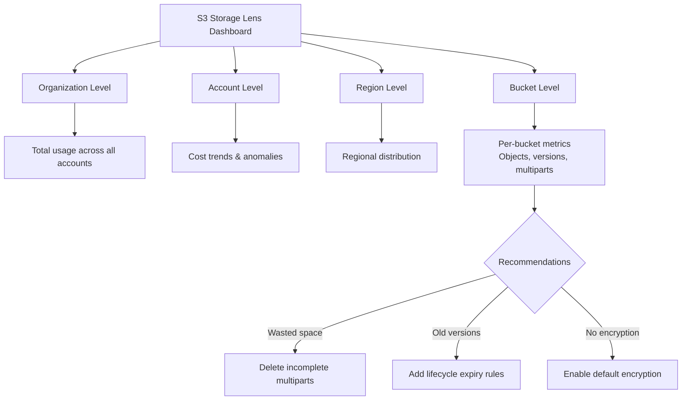
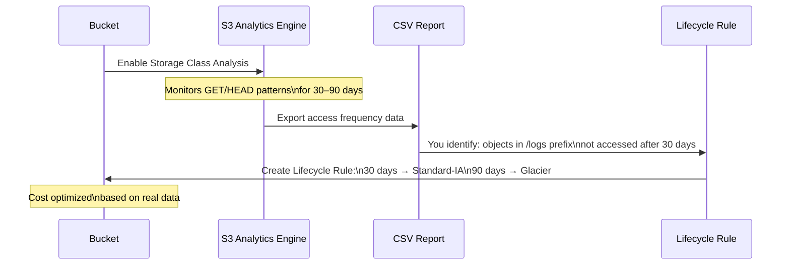
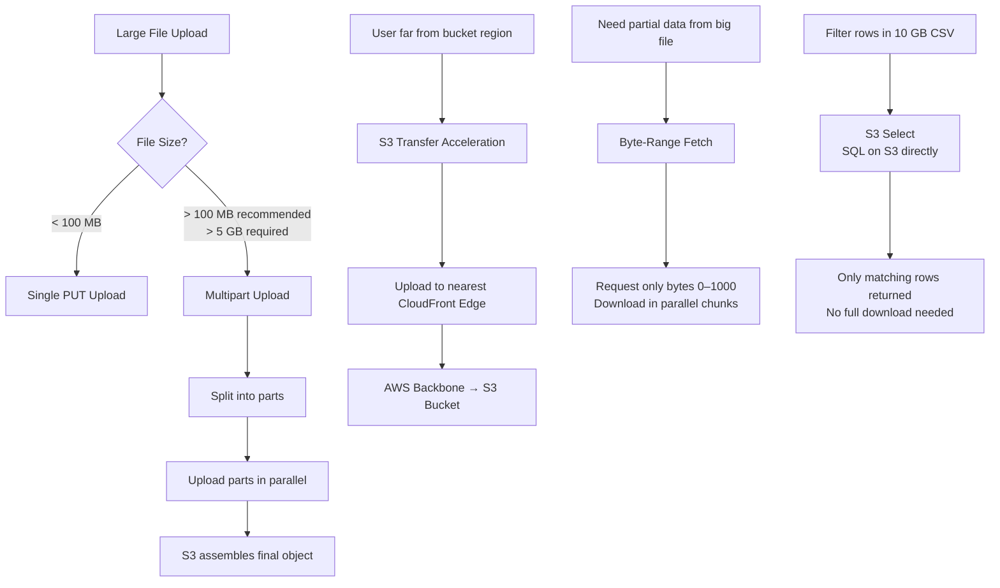
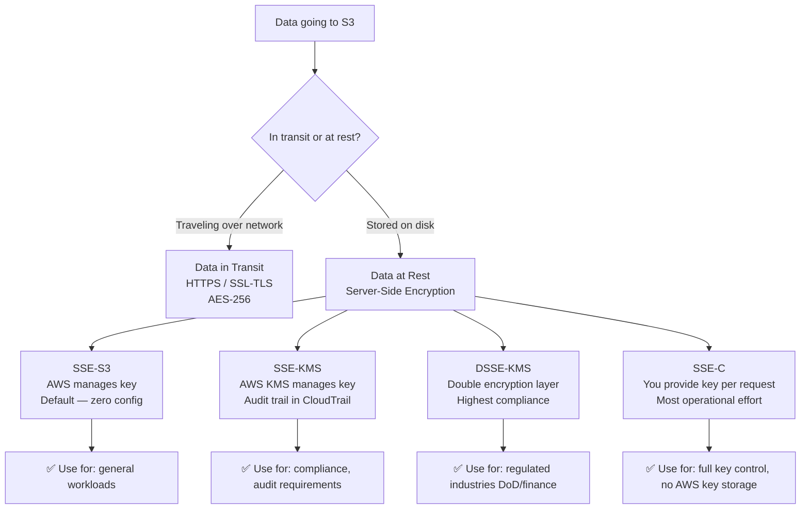

<!-- updated: 2026-06-26T11:00:00.000Z -->
## Hot / Warm / Cold Data Tiers

- A common industry model for classifying data by access frequency — maps directly to S3 storage classes:

| Tier | Access Frequency | S3 Classes | Cost |
|---|---|---|---|
| 🔥 **Hot** | Daily / constantly | Standard | Highest |
| 🌤️ **Warm** | Weekly / monthly | Standard-IA, One Zone-IA | Medium |
| ❄️ **Cold** | Rarely / archive | Glacier IR, Glacier FR, Glacier Deep Archive | Lowest |

- **Hot data** = live production data, frequently accessed — needs instant response
- **Warm data** = infrequently accessed but still needed occasionally — backups, DR, older records
- **Cold data** = archived, compliance, long-term retention — rarely or never accessed

> 🏢 **Real world:** Dropbox classifies all user files automatically — files opened in the last 30 days are Hot (Standard), files not touched in 3 months are Warm (Standard-IA), files in deleted/archived folders are Cold (Glacier). This tiering saves Dropbox millions per month in S3 costs without users noticing any difference.

---

## S3 Durability vs Availability

- **Durability** = will your data exist / not be lost? → **11 nines (99.999999999%)** — constant across ALL 7 storage classes, no exceptions
  - In practice: storing data for 10,000 years, you might lose 1 file — effectively zero data loss
  - **Data integrity** = the data you retrieve is byte-for-byte identical to what you stored
- **Availability** = how fast/readily can you access the data? → this is what differs between classes
  - Availability = "readiness" — how quickly does the class respond when you request data
  - Higher availability = higher cost; lower availability = lower cost
- **Key exam rule**: durability is always the same; availability and cost vary by class

> 🏢 **Real world:** Netflix stores movies in S3. A currently trending movie lives in Standard (instant access). An old movie from 2005 rarely watched lives in Glacier (hours to retrieve). Same durability — Netflix won't lose either file — but very different availability and cost.

---

## S3 Storage Classes — All 7 Types

| Class | Availability | Use Case | Min Storage |
|---|---|---|---|
| Standard | 99.99% | Frequently accessed, default | None |
| Standard-IA | 99.9% | Infrequent access, backups, DR | 30 days |
| One Zone-IA | 99.5% | Infrequent, single AZ, regenerable data | 30 days |
| Glacier Instant Retrieval | 99.9% | Archive, millisecond retrieval | 90 days |
| Glacier Flexible Retrieval | 99.99% | Archive, 5 min–12 hrs retrieval | 90 days |
| Glacier Deep Archive | 99.99% | Long-term archive 7–10 yrs, 12–48 hrs | 180 days |
| Intelligent Tiering | 99.9% | Unknown/changing access patterns | None |

**Latency order** (fastest → slowest):
`Standard < IA < One Zone-IA < Glacier IR < Glacier FR < Glacier Deep Archive`

**Cost order** (most expensive → cheapest):
`Standard > IA > One Zone-IA > Glacier IR > Glacier FR > Glacier Deep Archive`

- **One Zone-IA**: data stored in only 1 AZ — if that AZ goes down, data is lost; use only for data that can be regenerated; 99.5% availability; 20% cheaper than Standard-IA
- **Glacier Instant Retrieval**: millisecond access despite being archive — best of both worlds but costs more than Flexible
- **Glacier Flexible Retrieval**: 5 min (expedited), standard 3–5 hrs, bulk 5–12 hrs
- **Glacier Deep Archive**: cheapest of all; standard 12 hrs, bulk 48 hrs; minimum 180 days storage
- You pay for **storage + access** on all 6 standard classes

> 🏢 **Real world:** Airbnb stores listing photos (Standard — accessed constantly by users), booking records older than 2 years (Standard-IA — accessed occasionally for disputes), financial compliance records (Glacier Deep Archive — kept 7+ years, rarely accessed, cheapest possible storage). One company, three classes, dramatically different costs.

⚠️ **Exam tip:** Sharanya explicitly flagged: **durability is constant (11/9) across ALL classes — only availability changes**. Also: cost is determined by availability — faster access = more expensive. Scenario questions will describe access frequency and budget constraints; map them to the right class.

---

## S3 Intelligent Tiering

- Designed for data with **unknown or unpredictable access patterns**
- AI/ML continuously monitors access frequency of each object
- Automatically moves objects between tiers without you writing any lifecycle rules:
  - Frequently accessed → Standard tier
  - Not accessed for 30 days → moves to IA tier automatically
  - Not accessed for 90 days → moves to Glacier automatically
- You pay a **small monitoring fee** per object on top of storage costs (the "AI fee")
- Unlike other classes: you do **not pay for access/retrieval** — only storage + monitoring fee
- Best for: large datasets where you don't know which files will be accessed when

> 🏢 **Real world:** Spotify stores hundreds of millions of user-generated playlists and old podcast episodes in S3 with Intelligent Tiering. A playlist from 2018 that suddenly goes viral gets automatically moved back to Standard. A newly uploaded podcast that nobody listens to after 30 days automatically drops to IA. Spotify pays zero per-retrieval fees and zero engineering time managing lifecycle rules.

⚠️ **Exam tip:** Intelligent Tiering = "unaware of accessibility" — you don't know the pattern, AI figures it out. Key difference from other classes: **no retrieval fee**, but you pay extra monitoring cost per object.

---

## Storage Layout Tracking via S3 Storage Lens

- **S3 Storage Lens** is a cloud-wide analytics dashboard that gives visibility into storage usage, activity trends, and cost-optimization opportunities across all buckets and accounts
- Aggregates metrics at the organization, account, region, or bucket level — a single pane of glass for all your S3 data
- Key metrics it tracks:
  - Total storage size and object count per bucket
  - Incomplete multipart uploads (wasted storage)
  - Non-current version object count (leftover old versions)
  - % of unencrypted or non-versioned objects
  - Data access patterns (GETs vs PUTs ratios)
- Free tier: 28 core metrics updated daily; paid tier adds advanced metrics and prefix-level drill-down
- Storage Lens **recommends specific actions** — e.g. "enable lifecycle rules to expire old versions" or "you have 500 GB of incomplete multipart uploads — delete them"

> 🏢 **Real world:** Atlassian (makers of Jira & Confluence) manages thousands of S3 buckets across multiple AWS accounts for different product teams. Storage Lens gives their platform team a single dashboard showing which teams are accumulating non-current versions or stale uploads — saving them tens of thousands of dollars per month by automatically surfacing what to clean up, without needing to audit each bucket manually.

---

## S3 Analytics

- **S3 Analytics** (Storage Class Analysis) monitors access patterns on individual buckets to help you decide **when to transition objects** to cheaper storage classes
- Analyses GET/HEAD request patterns per object prefix over 30 days minimum (typically 30–90 days to build a reliable recommendation)
- Produces a CSV report you can view in the S3 console or export to another bucket for further analysis
- Key output: a recommendation like "objects in this prefix have not been accessed for 45+ days — transition to Standard-IA"
- Difference from Storage Lens:
  - **Storage Lens** = org-wide, big-picture storage health
  - **S3 Analytics** = bucket/prefix-level, access pattern detail to guide lifecycle rules
- Typically used as the **precursor to writing a Lifecycle Rule** — let it run for 30 days, then set up the rule based on what it found

> 🏢 **Real world:** GitHub stores millions of repository archives and CI artifact files in S3. Before setting lifecycle policies, they ran S3 Analytics on their artifact buckets for 60 days. The report showed that 80% of artifacts are never accessed after the first 7 days. GitHub then created a lifecycle rule: after 7 days move to Standard-IA, after 30 days move to Glacier — reducing storage costs by ~65% on that bucket class, based on real access data, not guesswork.

⚠️ **Exam tip:** S3 Analytics doesn't do anything automatically — it only *observes and reports*. You still write the Lifecycle Rule yourself. It's the data source for making a smarter decision.

---

## S3 Performance

- S3 baseline performance per prefix:
  - **3,500 PUT/COPY/POST/DELETE requests per second**
  - **5,500 GET/HEAD requests per second**
- Performance scales **per prefix** — distributing objects across multiple prefixes multiplies your throughput ceiling
  - Example: 4 prefixes = 22,000 GETs/sec total
- **Multipart Upload**: recommended for files > 100 MB, required > 5 GB
  - Splits file into parts, uploads in parallel, then S3 assembles them
  - Faster uploads + resumable (only failed parts retry, not the whole file)
- **S3 Transfer Acceleration**: routes uploads through AWS CloudFront edge locations — faster for geographically distant clients
  - Data travels over AWS backbone (faster) instead of public internet (slower)
  - Use when uploading from far away (e.g. Europe to us-east-1 bucket)
- **Byte-Range Fetches**: download specific byte ranges of a large object in parallel
  - Like downloading a file in chunks simultaneously — much faster than a single sequential GET
  - Also useful if you only need part of a file (e.g. the header of a large CSV)
- **S3 Select**: execute SQL queries directly on S3 objects (CSV, JSON, Parquet) without downloading the whole file — only pay for and receive the filtered data

> 🏢 **Real world:** Canva users upload design files (often 50–200 MB) from all over the world to their S3 buckets in us-east-1. Canva uses Transfer Acceleration so a user uploading from Sydney hits an AWS edge location in Australia first — their file travels 2ms to the edge, then over AWS's private backbone to Virginia, instead of the full public internet route. Upload times dropped by ~60% for Asia-Pacific users. For large design templates (>100 MB), multipart upload means a failed WiFi doesn't restart from zero.

⚠️ **Exam tip:** Performance questions often test prefix-based scaling (more prefixes = more throughput), multipart upload thresholds (100 MB recommended / 5 GB required), and when to use Transfer Acceleration (distant uploads) vs Byte-Range Fetches (parallel downloads of large objects).

---

## S3 Encryption

- **Rule #1:** Never store raw data in S3 — raw data is strictly prohibited in production. All data must be encrypted.
- Encryption is applied at **two separate levels**:
  - **Data in transit** — data traveling between client and S3 over the network
  - **Data at rest** — data stored on S3 storage devices

### Data in Transit
- Protected using **SSL/TLS certificates** → enforces **HTTPS**
- HTTP = unencrypted, insecure; HTTPS = encrypted channel
- Algorithm standard used: **AES-256** (Advanced Encryption Standard, 256-bit) — the de facto industry standard
- Example: uploading a file to S3 over HTTPS means the entire transfer is encrypted end-to-end

### Data at Rest — S3 Server-Side Encryption (SSE) Types

| Type | Who manages the key | Algorithm | Notes |
|---|---|---|---|
| **SSE-S3** | AWS manages everything | AES-256 | Default — simplest, zero management |
| **SSE-KMS** | AWS KMS manages key, you control policy | AES-256 | Audit trail in CloudTrail, customer control |
| **DSSE-KMS** | AWS KMS, double layer | AES-256 applied twice | Strongest — for regulated industries |
| **SSE-C** | You provide the key | AES-256 | AWS encrypts but never stores your key |

- **SSE-S3** (default since Jan 2023): AWS automatically encrypts every object — you do nothing
- **SSE-KMS**: uses AWS Key Management Service — you get full audit logs of who accessed which key and when; supports customer-managed keys (CMK)
- **DSSE-KMS**: dual-layer encryption — applies KMS encryption twice; required for some compliance standards (DoD, financial)
- **SSE-C**: you bring your own key on every request — AWS uses it to encrypt/decrypt but never persists it; most operational overhead

### Encryption Key Concepts (from class)
- **Symmetric encryption**: one single key for both encrypting and decrypting — simpler, faster
- **Asymmetric encryption**: two keys — one public key for encryption, one private key for decryption — more secure for key exchange
- S3 server-side encryption uses **symmetric keys** (AES-256) — AWS handles the key exchange complexity

> 🏢 **Real world:** Stripe stores billions of payment records in S3 using SSE-KMS with customer-managed keys. Every time a file is accessed, AWS CloudTrail logs which key was used, by whom, and at what time. Stripe's compliance team uses these audit logs to prove to regulators (PCI-DSS) that payment data is encrypted and access is controlled. SSE-S3 would encrypt the data but give no audit trail — SSE-KMS is the choice when you need to prove compliance.

⚠️ **Exam tip:** SSE-S3 is the default since Jan 2023 — all new objects are encrypted automatically with no action needed. SSE-KMS costs extra (per API call to KMS) but gives you CloudTrail audit logs. DSSE-KMS is the answer when a question mentions "dual-layer" or "double encryption". SSE-C is the answer when a question says "customer provides their own encryption key".

---
