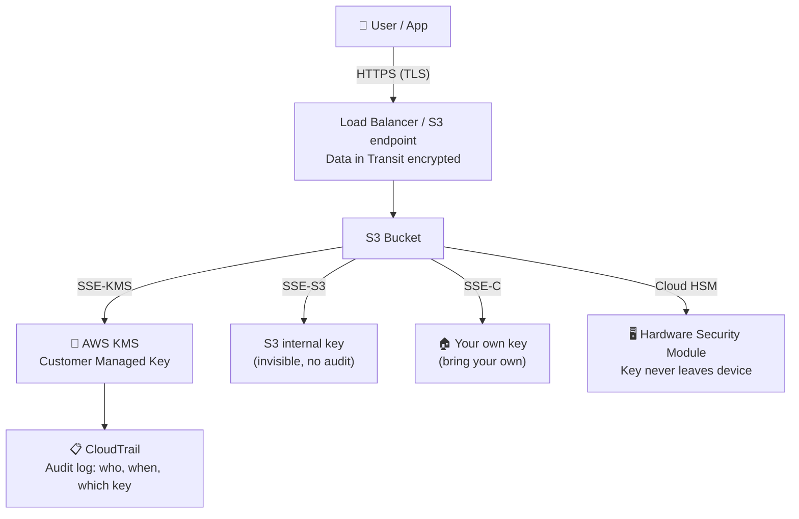
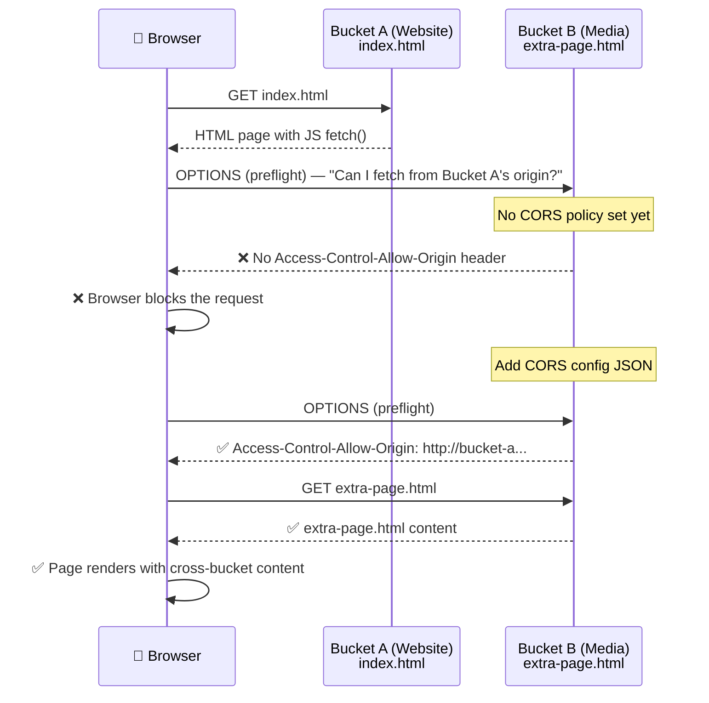
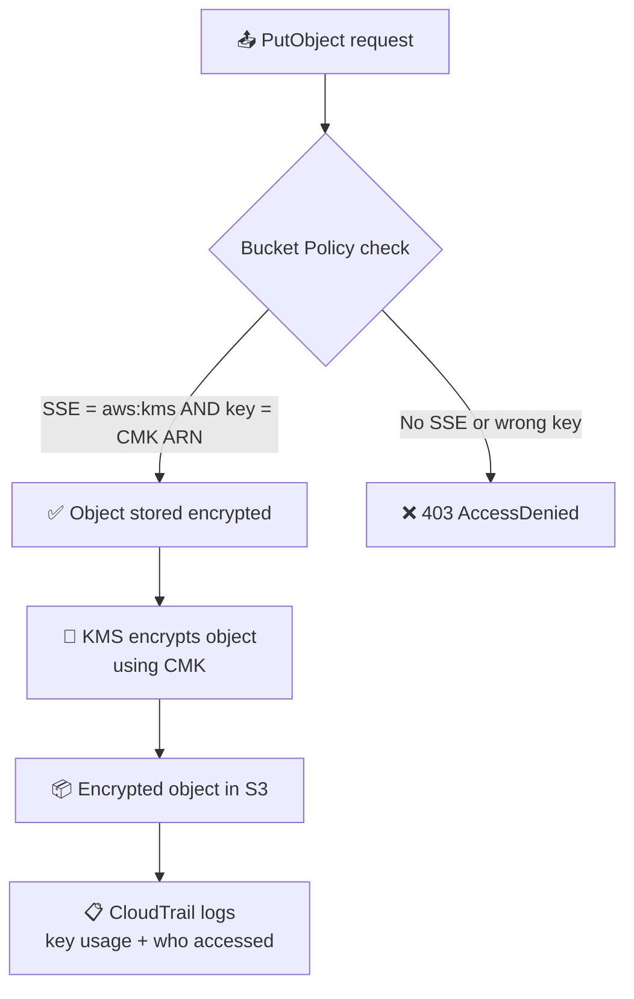
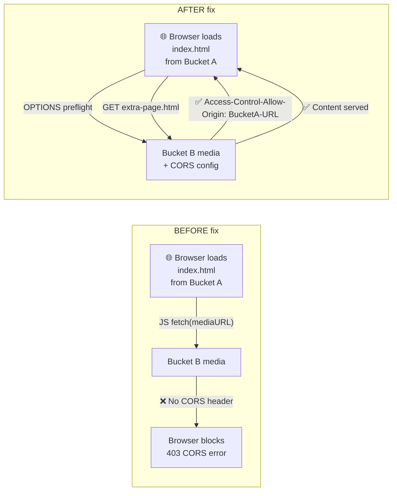

<!-- updated: 2026-06-29T12:00:00.000Z -->
## S3 Encryption — Deep Dive

- Encryption applies at **two levels**: data in transit and data at rest
- **Data in transit** → secured via HTTPS / SSL-TLS certificates (AES-256 over the wire)
- **Data at rest** → secured via KMS (Key Management Service) or S3-managed keys

### Encryption Types Compared

| Type | Key managed by | Visibility | Cost | Use case |
|---|---|---|---|---|
| **SSE-S3** | AWS (S3) | None — unique key per object, opaque | Free | Simple encryption, no audit needed |
| **SSE-KMS** | AWS KMS | Full audit trail in CloudTrail | $1/key/month | Compliance, regulated data |
| **DSSE-KMS** | AWS KMS (dual layer) | Full audit trail | Higher | DoD / highest compliance |
| **SSE-C** | Customer | You manage outside AWS | Free | Bring your own key |
| **Cloud HSM** | Customer hardware module | Keys never leave the device | Device cost | Banking, PCI-DSS |

- **SSE-S3**: generates a unique, opaque key for every object. You have zero visibility or control. Security is minimal — AWS manages everything silently. Least preferred.
- **SSE-KMS**: uses KMS Customer Managed Keys (CMK). Every encrypt/decrypt call is logged in CloudTrail. Same CMK can be reused across S3, EBS, RDS, etc.
- **Cloud HSM**: physical tamper-resistant hardware module. Cryptographic key material never leaves the device. Required by some banking/financial institutions.
- **Bucket policy enforcement**: use `aws:SecureTransport: false → Deny` to force HTTPS, and `s3:x-amz-server-side-encryption: aws:kms → Allow` to enforce KMS on every upload



> 🏢 **Real world:** Stripe stores billions of payment records in S3 using SSE-KMS with CMKs. Every access is logged in CloudTrail — who accessed which file, with which key, at what time. PCI-DSS compliance requires this audit trail. SSE-S3 would also encrypt the data but provides no audit trail, which is why Stripe uses SSE-KMS.

---

## CORS — Cross-Origin Resource Sharing

- **The problem**: browsers block requests where a web page on one origin (domain) tries to fetch resources from a *different* origin (domain/bucket)
- This is a browser security feature — not an AWS limitation
- **The S3 scenario**: an HTML page hosted in Bucket A (`index.html`) fetches an asset from Bucket B (the "media" bucket) via JavaScript `fetch()`. The browser blocks it with: `Access to fetch has been blocked by CORS policy: No 'Access-Control-Allow-Origin' header is present on the requested resource`

### How CORS Works

| Term | Meaning |
|---|---|
| **Origin** | Protocol + domain + port — e.g. `http://my-bucket.s3-website-us-east-1.amazonaws.com` |
| **Cross-origin** | Request from origin A to a *different* origin B |
| **Preflight** | Browser sends HTTP `OPTIONS` to B first, asking "do you allow requests from A?" |
| **Access-Control-Allow-Origin** | Header B must return to grant permission |
| **Allowed Methods** | Which HTTP verbs B allows (GET, PUT, DELETE…) |
| **Allowed Headers** | Which request headers B accepts (Authorization…) |



### CORS Configuration JSON (applied to the Media bucket)

```json
[
  {
    "AllowedHeaders": ["Authorization"],
    "AllowedMethods": ["GET"],
    "AllowedOrigins": ["http://your-main-bucket.s3-website-us-east-1.amazonaws.com"],
    "ExposeHeaders": [],
    "MaxAgeSeconds": 3000
  }
]
```

- `AllowedOrigins`: exact URL of the website bucket — no trailing slash, match the protocol (HTTP not HTTPS for plain S3 static sites)
- Applied under: S3 Console → Media Bucket → Permissions → Cross-origin resource sharing (CORS)

> 🏢 **Real world:** Spotify's web player at `open.spotify.com` fetches album art and audio files from a separate CDN/S3 origin (`i.scdn.co`). Without CORS headers on the media origin, the browser would block every image and audio stream. The CORS config allows `open.spotify.com` to read from the media bucket — every stream you hear goes through this exact mechanism.

---

## S3 Static Website Hosting

- S3 can serve an HTML site directly — no EC2, no server needed
- Bucket acts as a web server for static files (HTML, CSS, JS, images)

### Steps to enable

- Bucket → Properties → **Static website hosting** → Enable
- Set **Index document**: `index.html` (case sensitive)
- Bucket → Permissions → **Block all public access** → uncheck (set OFF)
- Add a **bucket policy** to allow public `GetObject`

> 🏢 **Real world:** GitHub Pages is built on this exact model — a static site served from object storage (their own infra mirrors S3's design), no app servers, fully scalable. Your portfolio site can do the same on S3 for ~$0.023/GB/month.

---

## S3 Policy Generator Tool

- AWS provides a web tool to generate bucket/IAM/SNS/SQS policies without writing JSON from scratch
- Steps: select policy type → set Effect (Allow/Deny) → set Principal (who) → set Actions → set Resource (ARN) → Generate Policy
- Useful for: quickly building `Deny: DeleteObject` policies, enforcing encryption conditions, or restricting access to specific IAM users

---

<!-- LABS_TAB -->

## Lab 1 — Encrypting S3 Objects Using SSE-KMS

**Objective:** Enforce server-side encryption with a KMS Customer Managed Key on every object uploaded to an S3 bucket using a bucket policy.

### What you did step by step

- Opened the lab in QA Platform → started the sandbox
- Created or identified an S3 bucket in the AWS Console
- Navigated to KMS → created a **Customer Managed Key (CMK)** — gave it a name, set key administrators and key users (the lab role)
- Copied the **Key ARN** from KMS
- In the S3 bucket → **Permissions** → **Bucket Policy** — added a policy that:
  - **Denies** any `s3:PutObject` where `s3:x-amz-server-side-encryption` is NOT `aws:kms`
  - **Denies** any `s3:PutObject` where `s3:x-amz-server-side-encryption-aws-kms-key-id` does NOT equal your CMK ARN
- Tested: tried uploading an object without encryption → denied; tried uploading with SSE-KMS and the correct CMK → allowed

### Why this matters

Without the bucket policy, users can upload unencrypted objects even if you have a CMK. The policy is the enforcement layer — the CMK alone is not enough.



### Bucket Policy snippet used

```json
{
  "Version": "2012-10-17",
  "Statement": [
    {
      "Effect": "Deny",
      "Principal": "*",
      "Action": "s3:PutObject",
      "Resource": "arn:aws:s3:::YOUR-BUCKET-NAME/*",
      "Condition": {
        "StringNotEquals": {
          "s3:x-amz-server-side-encryption": "aws:kms"
        }
      }
    },
    {
      "Effect": "Deny",
      "Principal": "*",
      "Action": "s3:PutObject",
      "Resource": "arn:aws:s3:::YOUR-BUCKET-NAME/*",
      "Condition": {
        "StringNotEquals": {
          "s3:x-amz-server-side-encryption-aws-kms-key-id": "arn:aws:kms:REGION:ACCOUNT:key/YOUR-KEY-ID"
        }
      }
    }
  ]
}
```

> 🏢 **Real world:** A healthcare company stores patient MRI scans in S3. Compliance (HIPAA) requires every file to be encrypted with a key they control. The bucket policy ensures no developer can accidentally upload an unencrypted file — the upload is rejected at the API level before the object is ever stored.

---

## Lab 2 — S3 CORS (Cross-Origin Resource Sharing)

**Objective:** Host a static website in one S3 bucket that fetches content from a second "media" S3 bucket — and fix the browser CORS error that blocks it.

### What you did step by step

- Received a ZIP file from the instructor containing: `index.html`, `extra-page.html`, `coffee.jpg`, `cors_config.json`
- Opened the files in VS Code to understand the structure:
  - `index.html` has a `<script>` that uses `fetch('extra-page.html')` to load a secondary page
  - `extra-page.html` just says "This extra page has been successfully loaded"
- **Created two S3 buckets**: one website bucket (main), one media bucket (with `-media` suffix)
- **Main bucket setup**:
  - Uploaded `index.html`, `extra-page.html`, `coffee.jpg`
  - Disabled Block Public Access
  - Enabled Static Website Hosting → index document: `index.html`
  - Added public read bucket policy (`GetObject` for `*`)
  - Confirmed the site loads — the extra page content shows (same bucket fetch works)
- **Introduced the CORS problem**:
  - Deleted `extra-page.html` from the main bucket
  - Uploaded `extra-page.html` to the **media bucket** instead
  - Copied the media bucket's object URL for `extra-page.html`
  - Updated `index.html` line 17: replaced `'extra-page.html'` with the full media bucket URL
  - Re-uploaded `index.html` to the main bucket (deleted old version first)
  - Refreshed the website → content gone, Chrome console shows CORS error
- **Fixed with CORS config**:
  - Edited `cors_config.json` — set `AllowedOrigins` to the main bucket's website URL (no trailing slash, HTTP not HTTPS)
  - In AWS Console → Media bucket → Permissions → Cross-origin resource sharing → Edit → pasted the JSON → Save
  - Refreshed the website → page loads successfully with the extra page content from the media bucket



### File structure used

```
s3.zip
├── index.html          (website entry — fetches extra-page from media bucket)
├── extra-page.html     (goes in MEDIA bucket, fetched cross-origin)
├── coffee.jpg          (image, stays in main bucket)
└── cors_config.json    (CORS policy, applied to media bucket)
```

### cors_config.json

```json
[
  {
    "AllowedHeaders": ["Authorization"],
    "AllowedMethods": ["GET"],
    "AllowedOrigins": ["http://your-main-bucket.s3-website-us-east-1.amazonaws.com"],
    "ExposeHeaders": [],
    "MaxAgeSeconds": 3000
  }
]
```

> 🏢 **Real world:** Netflix's web player at `netflix.com` streams video chunks from a separate media CDN origin. Without CORS headers on the media servers, every browser would block the video stream. The CORS policy on the media servers explicitly allows `netflix.com` as a trusted origin — the exact same mechanism you just built with two S3 buckets.
