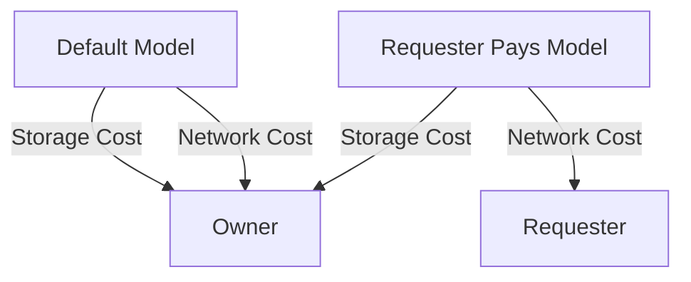

<!-- updated: 2026-06-30T11:20:35.000Z -->
## Batch Processing in AWS

- **Definition:** Execution of similar tasks on a large scale in parallel to reduce manual intervention and latency.
- **Key Benefits:**
  - Automates repetitive tasks (e.g., deleting multiple files, updating system processes).
  - Reduces latency compared to manual operations.
  - Supports scalability for large datasets (e.g., millions of objects in S3).
- **AWS Services for Batch Processing:**
  - **S3 Batch Operations:**
    - Features:
      - Managed service allows task execution across S3 objects or prefixes.
      - Supports a variety of tasks, such as copying, tagging, and deleting.
    - Costs:
      - Approximately $1 per million objects, with additional costs of $0.25 per 250K objects.
  - Common scripts required:
    - Object list (identifies the target objects).
    - Task definition (specifies the action to perform, e.g., delete, copy, change class).
  - **Example Operations:**
    - Copying 10,000 files from one S3 bucket to another.
    - Generating monthly usage reports for AWS accounts through batch jobs.

> 🏢 **Real world:** A large research university stores vast datasets in S3 for scientific experiments. Students request specific subsets of this data, and batch operations are used to fulfill requests efficiently.

---

## Requester Pays Option in S3

- **Definition:** Shifts network (data transfer) costs from the bucket owner to the individual requesters.
- **Default Setup:**
  - Bucket owner pays for both storage and network transfer costs.
- **Requester Pays Setup:**
  - Bucket owner pays only for storage.
  - Requester pays for:
    - Data transfer (network cost).
    - Additional download-specific charges, if applicable.
- **Benefits:**
  - Perfect for scenarios where users are geographically distributed.
  - Reduces costs for the bucket owner by offloading variable network charges.
- **Authentication:**
  - Requesters must authenticate through credentials (e.g., login to a website or app).
- **Use Cases:**
  - Premium file downloads where users pay per video/paper.
  - Controlled datasets, such as research institutions offering limited access to datasets for a fee.

| Comparison        | Default Setting              | Requester Pays Setting        |
|--------------------|------------------------------|--------------------------------|
| **Network Cost**  | Bucket owner bears expense  | Requester bears expense       |
| **Storage Cost**  | Bucket owner bears expense  | Bucket owner bears expense    |
| **Use Case**      | General public access        | Restricted/requested access   |

> 🏢 **Real world:** A streaming platform implements "Requester Pays" for premium content downloads. Customers are charged per video download, covering both network transfer fees and content fees.

---

## Pricing and Cost Management in S3 Batch Operations

- **Pricing Overview:**
  - $1 per 1 million objects for the first batch job.
  - Additional charge of $0.25 for every 250K objects after the first million.
  - Tasks are charged for object processing and task execution.
- **Optimization Strategies:**
  - Use batch scripts to minimize manual processing.
  - Opt for the "Requester Pays" model to reduce network-related costs.

> 🏢 **Real world:** A company with a massive S3 dataset implemented batch processing to re-tag all objects for more efficient data classification. By leveraging batch operations, the task was completed in minutes instead of days.

---

### Mermaid Diagram: Default vs Requester Pays Model in S3

---

## Exam Tips

- **Batch Processing:**
  - Recognize its role in automating repetitive tasks at scale.
  - Understand pricing tiers for batch jobs.
- **Requester Pays:**
  - Be familiar with its cost optimization for S3 buckets.
  - Apply this model when asked how to reduce network transfer costs in AWS.
