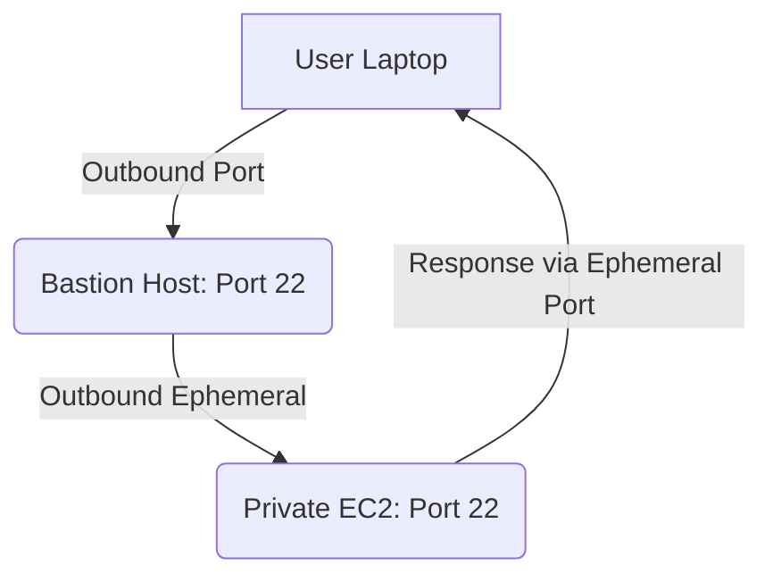
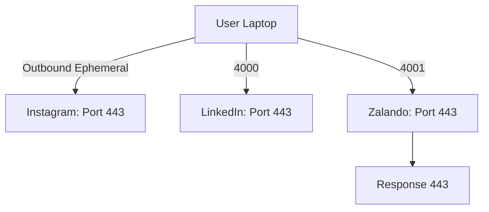

<!-- updated: 2026-07-08T07:43:00.000Z -->
## SSH Ports and Communication

- **Port 22:** Always used for SSH communication; it's an incoming port.
- **Ephemeral Ports:** Temporary outbound ports used for session responses. Range: `1024-65535`.
- Fixed ports (`0-1023`) are reserved for system-defined protocols, such as HTTP (80), HTTPS (443), etc.
- **Port allocation process for SSH:**
  - Outbound requests choose ephemeral ports dynamically.
  - Incoming responses to port 22 determine the application context.

> 🏢 Real world: Netflix engineers use Bastion hosts with SSH to securely manage EC2 instances in private subnets, leveraging ephemeral ports to handle outbound requests across multiple sessions.

### Port Comparison Table

| Port Type      | Range         | Purpose             | Examples                 |
|----------------|---------------|---------------------|--------------------------|
| Fixed Ports    | `0-1023`      | Reserved (OS/Protocols) | HTTP (80), HTTPS (443)   |
| Ephemeral Ports| `1024-65535`  | Outbound communication | Dynamic SSH connections |

---

## Security Groups 

- **Stateful:** Tracks inbound and outbound connections, allowing responses without explicit rules for return traffic.
- **Allow rules only:** Allows specific traffic as per configuration; cannot include deny rules.
- **Maximum rules:** You can define up to 60 allow rules per security group.
- Security groups operate at the instance level.

> 🏢 Real world: AWS Lambda functions use security groups to allow external services to send HTTP requests while restricting other inbound traffic for secure interactions.

### Mermaid Diagram: Security Group Workflow

---

## Network Access Control List (NACL)

- **Stateless:** Unlike security groups, rules in NACL are individually applied to inbound and outbound traffic.
- **Support allow and deny rules:** Flexibility to enhance security.
- **Dynamic assignments:** Allows configuration for ephemeral ports (`1024-65535`) to handle outbound requests.

> 🏢 Real world: A fintech company uses NACLs to block suspicious IP ranges while allowing secure traffic to their application servers.

---

### HTTPS Outbound Port Usage

- Outbound request protocols like HTTPS use ephemeral ports (`1024-65535`) dynamically.
- **Inbound HTTPS ports:** Fixed at 443 for receiving responses.
- Outbound ports are selected randomly by the operating system.

> 🏢 Real world: Amazon.com handles millions of HTTPS requests via browsers every day, with outbound requests utilizing ephemeral ports for session tracking.

### Mermaid Diagram: Outbound HTTPS Workflow Example

---

### Bastion Host Setup for SSH

- Acts as a jump box for private EC2 management.
- Outbound Ephemeral Ports: Responsible for forwarding responses.
- **Inbound Port:** Always 22 for SSH.

> 🏢 Real world: A healthcare company uses Bastion hosts to establish secure connections between administrators on VPNs and private EC2 databases storing patient data.

---

### Summary of Best Practices

1. Configure security groups for specific protocols by defining appropriate inbound ports.
2. Use ephemeral ports in NACLs for outbound traffic and response handling.
3. Always verify security group setups to allow proper functioning of Bastion hosts and private EC2 instances.
