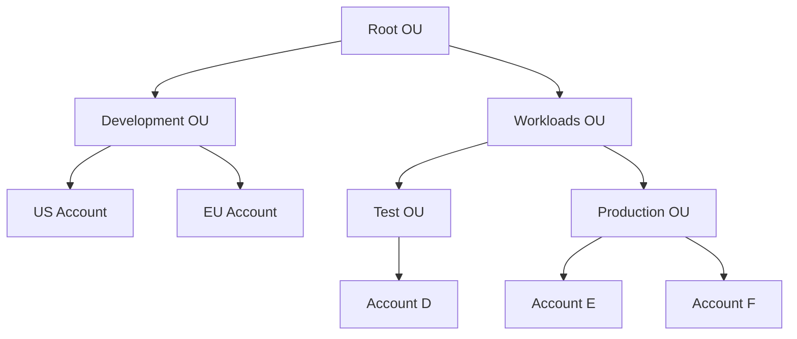

<!-- updated: 2026-07-08T07:43:33.000Z -->
## Reserved Instances (RI)
- Reserved Instances offer significant discounts (72-75%) compared to on-demand instances.
- Commitment periods: 1 year or 3 years (no modifications allowed).
- RIs are instance-specific (e.g., EC2 instance type, AMI).
- If one team no longer needs the RI, it can be reassigned or shared across other teams in the organization to optimize costs.

> 🏢 **Real world:** A US-based company completes a development project in 6 months but has a 3-year RI commitment. The remaining 2.5 years are shared with the production and finance teams in other regions, optimizing resources and reducing costs.

---

## Savings Plans
- Provide flexibility compared to RIs with no fixed period (can be reserved for any duration, e.g., 10 years).
- Offer discounts of 65-70%.
- Suitable for companies wanting to ensure long-term cost savings across multiple accounts.
- Savings Plans can be distributed across multiple teams and environments in the organization.

| Feature                | Reserved Instances (RI)       | Savings Plans               |
|------------------------|-------------------------------|-----------------------------|
| **Commitment Period**  | Fixed (1 or 3 years)          | Flexible, no fixed period   |
| **Discount**           | 72-75%                       | 65-70%                      |
| **Flexibility**        | Less flexible                | More flexible               |
| **Use Case**           | Predictable workloads        | Long-term cost optimization |

> 🏢 **Real world:** A multinational company reserves a Savings Plan for 10 years, achieving long-term cost efficiency while scaling their EC2 usage across various teams, including HR, production, and development.

---

## AWS Organizations
- Enables centralized account management across multiple AWS accounts. 
- Provides the ability to group accounts into Organizational Units (OUs) based on environments (e.g., development, production) or business units (e.g., sales, research, HR).
- Policies can be attached at the organizational, OU, or account levels.
  - Combining OU policies with specific account policies creates granular control over permissions.
- Supports cross-account IAM roles for giving access between accounts within an organization.
- Management account or root OU has complete control and cannot be deleted.

### Advantages of AWS Organizations:
- Granular permissions using OUs, accounts, and IAM roles.
- Single, consolidated billing system.
- Use tags for organizing and itemizing costs for better billing insights.
- Ability to log activities at three levels: organization, account, and IAM user, with tools like AWS CloudWatch.
- Centralized management allows better control of the organization and its entities.

#### Organizational Units Example

- Permissions can be set at the group level:
  - Sandbox group with "Full AWS Access" minus S3 permissions for accounts A, B, and C.
  - Denial overrides: Specific permissions (deny EC2) can also apply at the account level.
- Administrator roles/permissions:
  - Root User: Highest-level permission holder for an account.
  - Root OU and Management Account hold full access permissions.

> 🏢 **Real world:** Bosch creates an AWS Organization to manage research departments globally. They group all developers into one Development OU and apply unified policies (e.g., restricted S3 access) while maintaining control and compliance at both global and local-level accounts. Automated tagging helps with reporting and consolidated billing across the organization.
