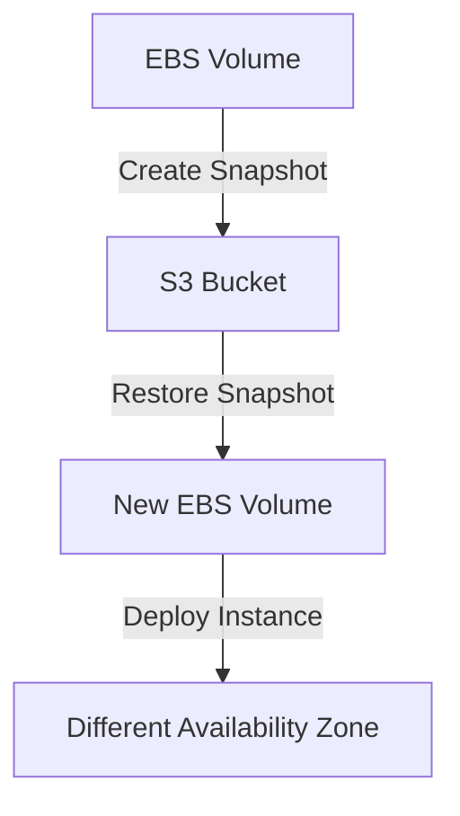

<!-- updated: 2026-07-08T07:44:03.000Z -->
## AWS Savings Plans
- Cost-saving approach to achieve discounts on EC2 and other AWS services by committing to consistent usage.
- Supports multiple EC2 instances, scaling to meet company demands, similar to scaling pods in Kubernetes.
- Upfront cost influences discount rate:
  - Larger upfront payment yields a better discount.
  - Companies confident in their resource needs (e.g., large enterprises) typically opt for higher upfront payments due to long-term savings.
- Reserved instances may complement savings plans for predictable workloads.

| Payment Type            | Typical Use Case                          | Discount Offered   |
|-------------------------|-------------------------------------------|--------------------|
| No upfront payment      | Companies with uncertain requirements     | Lowest discount    |
| Partial upfront payment | Balanced approach                         | Moderate discount  |
| Full upfront payment    | Predictable, long-term usage (e.g., 3 years) | Highest discount   |

> 🏢 Real world: Deloitte often opts for reserved instances due to the predictable workload of large-scale corporate operations.

---

## EC2 Spot Instances
- Low-cost EC2 option driven by spare capacity in AWS.
- Instances can be interrupted with a 2-minute notice if another bidder offers a higher price.
- Ideal for flexible workloads but poses reliability risks.
- Not suited for critical applications, e.g., hosting websites expecting high uptime and reliability.

> 🏢 Real world: Zalando might use spot instances for non-essential workloads but avoid them for the main website, which requires high uptime during sales events.

---

## Amazon Machine Images (AMI)
- Templates for EC2 instances containing preset configurations:
  - Operating system
  - Installed software
  - Files and applications
- Used to deploy identical instances, saving time and complexity in resource provisioning.
- AMIs are scoped to an Availability Zone (AZ) but can be copied across regions.
- Elastic IPs can be associated with EC2 instances for stable addressing.

> 🏢 Real world: Companies like Lenovo use AMIs to streamline mass production of devices with similar configurations. Just like repetitive EC2 instance setups save time in cloud environments, standardized device setups lower production costs for hardware.

---

## EBS Snapshots
- Serve as backups for EBS volumes and are stored in Amazon S3.
- Snapshots are used to restore data either in the same Availability Zone or in a different one.
- Restoration involves creating a new EBS volume from the snapshot.

Mermaid Diagram:

> 🏢 Real world: A backup system like EBS snapshots ensures data recovery for critical applications, such as restoring live customer databases after unintentional data deletion.

---

## Elastic IP
- A static public IP address allocated to your AWS account.
- Can be reassigned to different instances as needed without changing the IP.
- Highly useful for maintaining continuity when instances are stopped or terminated.

> 🏢 Real world: A SaaS company ensures its product's public-facing IP remains consistent, even if underlying EC2 instances are restarted or replaced, by using an Elastic IP.

---

## Looking Ahead
- Upcoming topics include:
  - Advanced EBS concepts and placement groups.
  - Exploration of S3 service use cases.
- Transition to Terraform curriculum from Week 7 to Week 10. Learning goals are available in the Git repository.
