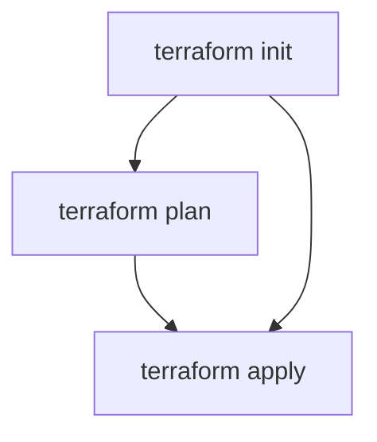
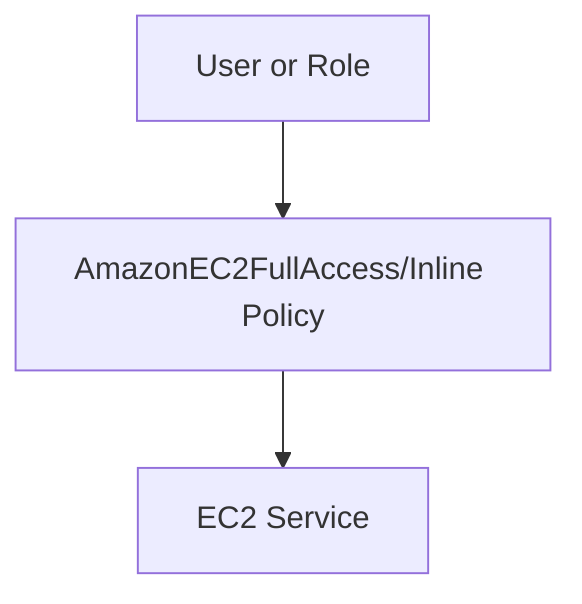

<!-- updated: 2026-07-08T07:45:07.000Z -->
## AMI (Amazon Machine Image)
- AMIs are regional-specific resources and must correspond to the region where you want to launch EC2 instances.
- EC2 instances are set up in Availability Zones within the selected region.
- AMI values in Terraform configurations must be enclosed in double quotes.

> 🏢 Real world: Netflix uses preconfigured AMIs for its streaming services, ensuring their EC2 instances start with consistent base configurations across multiple regions.

---

## EC2 Instance Types and Free Tier Eligibility
- Different EC2 instance types cater to different workloads.
- Some instance types, such as `t3.micro` and `t3.small`, are eligible for AWS Free Tier usage.
- Instance types like `t2.nano` are not covered under Free Tier.

| Instance Type | Free Tier Eligible? |
|---------------|----------------------|
| t3.micro      | Yes                 |
| t3.small      | Yes                 |
| t2.nano       | No                  |

> 🏢 Real world: Startups often use Free Tier EC2 instances (e.g., `t3.micro`) during their early development phases to reduce costs before scaling up with larger instance types.

---

## Terraform Command Workflow
- **`terraform init`**: Initializes the working directory, downloads plugins.
  - Must be executed in each new working directory.
- **`terraform plan`**: Optional. Generates an execution plan but skipped as `terraform apply` inherently performs this step.
- **`terraform apply`**: Deploys infrastructure as defined in the Terraform configuration.

Mermaid diagram for Terraform commands:

> 🏢 Real world: Spotify uses Terraform to provision its AWS infrastructure for consistent and predictable deployments across multiple regions.

---

## IAM Permissions for EC2 Instances
- IAM permissions control access to EC2 resources.
- Without proper permission, EC2 resources can't be created even if the Terraform configuration is correct.
- Inline policies allow customized permissions, but AWS's managed policies, like `AmazonEC2FullAccess`, are easier to attach for full access.

Mermaid diagram for IAM role setup:

> 🏢 Real world: Airbnb ensures role-based access control by attaching specific IAM policies for EC2 access to prevent unauthorized deployments.

---

## Resource Quotas in Free Tier
- AWS Free Tier accounts impose resource quotas (e.g., max number of EC2 instances).
- Instance creation errors may occur if quota limitations are exceeded.

| Resource Type  | Free Tier Limitation |
|----------------|-----------------------|
| EC2 Instances  | 5–15 Instances       |
| Storage Volume | Up to 30 GB          |

> 🏢 Real world: Startups like Slack often leverage AWS Free Tier as they scale their applications, closely monitoring resource usage to avoid exceeding quotas.

---

## Terraform AWS Instance Resource
- Terraform `aws_instance` resource is used to define and provision EC2 instances.
- Key properties:
  - `ami`: The AMI ID for instance creation.
  - `instance_type`: Defines the hardware configuration (e.g., `t3.small`).
  - Tags can be assigned for organizing resources.

> 🏢 Real world: Dropbox uses Terraform to standardize its EC2 provisioning process, reducing manual errors and ensuring reproducible configurations.

--- 

## Key Errors and Debugging EC2 Policies 
- EC2 execution requires valid credentials and IAM permissions.
- Errors like "no valid credential source" often indicate misconfigured IAM policies.
- Sharing exact code snippets and Terraform registry references helps debug and resolve issues.

> 🏢 Real world: Atlassian uses strict IAM policies to ensure only authorized workflows (via Terraform or console) can provision EC2 instances.
