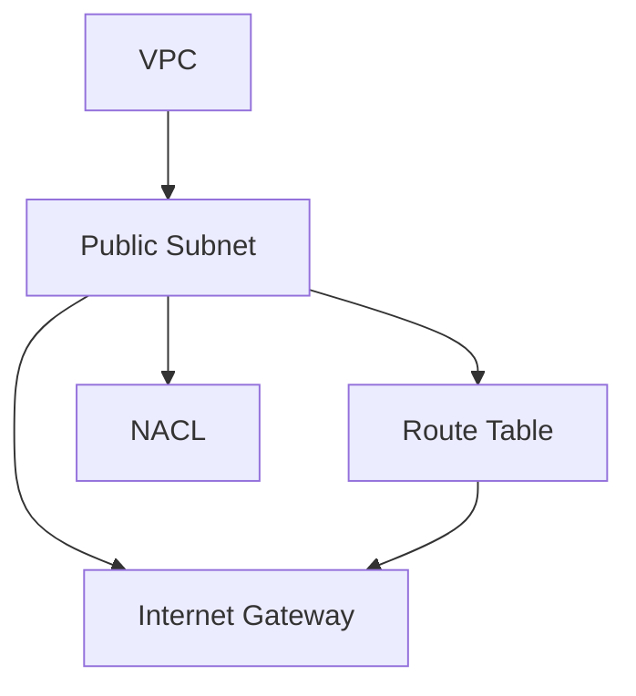
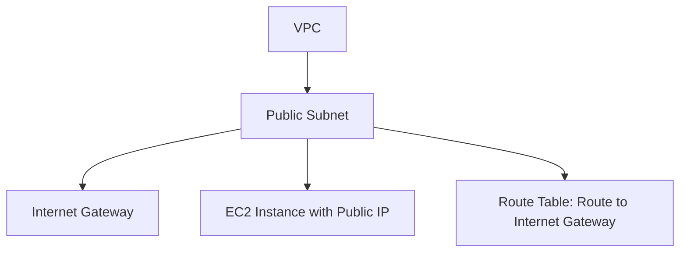

<!-- updated: 2026-07-08T11:48:12.000Z -->
## Terraform Exam Preparation
- Terraform certifications need to be renewed every two years.
- Core prerequisites for certification:
  - Basic terminal skills (Linux, CMD, PowerShell, VS Code).
  - Understanding of on-premise and cloud architecture.
- Exams typically have 65 questions, with 15 out-of-syllabus questions mixed in. No negative marking.
- Official syllabus consists of eight major topics.
- Study resources:
  - Official Terraform documentation.
  - Tutorials and official learning paths.

> 🏢 Real world: Companies like **Netflix** use Terraform for infrastructure as code to scale their cloud-native services across multiple regions seamlessly.

---

## Multi-Resource Architecture in AWS using Terraform
### Key Concepts:
- **Custom VPC**:
  - Requires creation of a CIDR block for IP allocation.
- **Subnets**:
  - Public subnets need an internet gateway.
  - Routing configurations in the route table.
  - CIDR block for subnet IRC.
- **Internet Gateway**:
  - Allows communication with external IPs.
- **Route Table**:
  - Routes for public subnets include pathways to the Internet Gateway (`destination 0.0.0.0/0`).
- **Security:**  
  - **NACL (Network ACL)**: Acts as a virtual firewall for subnets.
  - NAT Gateway is used for private subnets to access the internet without exposing IPs.

### Multi-Resource Architecture Diagram:

> 🏢 Real world: **Airbnb** deployed a multi-resource architecture in AWS using Terraform to optimize infrastructure and centralize cloud governance.

---

## Terraform Commands
### Key Commands:
- **`terraform init`**:
  - Initializes Terraform in the working directory.
  - Creates the `.terraform` folder and downloads required plugins.
  - Must be executed in every working directory.
  
- **`terraform plan`** (optional):  
  - Provides a ‘blueprint’ of what Terraform will execute (without deploying changes).
  - Used to view planned updates/modifications, especially for complex multi-resource setups.

- **Terraform State (`terraform.tfstate`)**:
  - Tracks current resource statuses (e.g., running, terminated).
  - Critical for maintaining resource synchronization between cloud and local configurations.

> 🏢 Real world: **Shopify** uses Terraform state files to track infrastructure changes during its CI/CD pipeline.

---

## Public Subnets Configuration
### Required Components:
1. **CIDR Blocks**:
   - Provides IP address ranges for the subnet.
2. **Route Table**:
   - Defines the path for the subnet to communicate externally via an Internet Gateway.
3. **Internet Gateway**:
   - Linked to the VPC to provide internet access.
4. **Public IP**:
   - Assigned to EC2 instances deployed in the public subnet.

### Public Subnet Diagram:

> 🏢 Real world: **Slack** utilizes public subnets in combination with Internet Gateways for global service interaction while routing requests through private subnets for backend workloads.

---

## Task for Today
- Create custom VPC with a subnet.
- Configure route table linked to the Internet Gateway for public subnet communication.
- Validate setup by executing `terraform plan` before deployment.
- Bookmark Terraform official website for continued study and hands-on tutorials.
