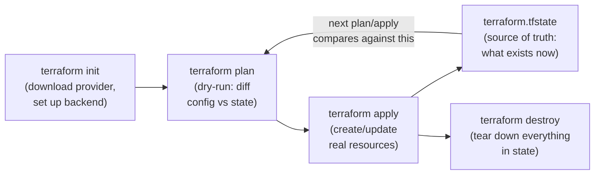

# Week 1 — Terraform Basics

## Concepts covered

- **Provider**: tells Terraform which cloud/API to talk to (`aws`) and how (region, credentials)
- **Resource**: a single infrastructure object Terraform manages (`aws_s3_bucket`)
- **Variables**: inputs so the same config can be reused with different values (`var.student_suffix`)
- **Outputs**: values printed after apply, and readable by other configs
- **State**: `terraform.tfstate` — Terraform's record of what it created. This is how it knows what to change or destroy later. **Never hand-edit it.**

## Workflow

```
terraform init      # downloads the aws provider plugin, sets up state
terraform plan      # shows what WOULD change — nothing is created yet
terraform apply     # creates/changes real resources
terraform destroy   # tears down everything this config created
```



> 🏢 **Real world:** Every AWS resource you clicked through in the console this month — VPCs, EC2 instances, S3 buckets — could instead be defined once in `.tf` files. Companies like Airbnb and Slack manage thousands of cloud resources this way: the `.tf` files are the single source of truth, checked into git, reviewed like code, and `terraform apply` is the only way changes reach production. No more "who clicked what in the console."

## Run it

```bash
cd terraform/day1
cp terraform.tfvars.example terraform.tfvars   # then edit student_suffix
terraform init
terraform plan
terraform apply
```

When done experimenting:
```bash
terraform destroy
```
