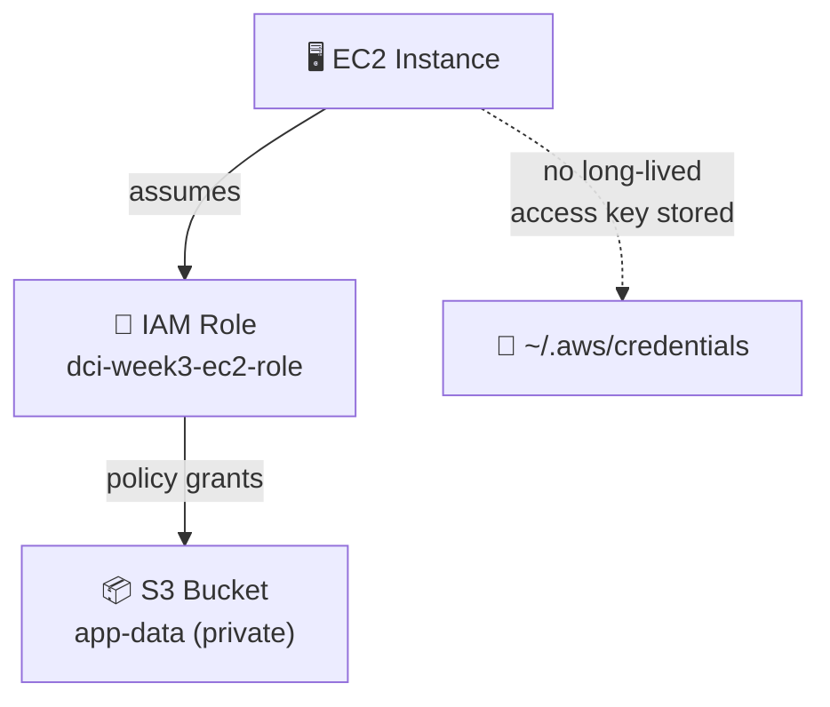

# Week 3 — Compute & Storage

## Concepts covered

- **EC2 instance**: a virtual machine, launched from an AMI (Amazon Machine Image) — here dynamically looked up via a `data` source instead of hardcoding an AMI ID (which changes per region/date)
- **S3 bucket**: private storage the instance can use, with Block Public Access fully enabled
- **IAM role + instance profile**: the instance authenticates to AWS using a *role*, not a hardcoded access key. This is the pattern real production systems use — no secrets living on disk on the box.
- **IAM policy document (`data "aws_iam_policy_document"`)**: HCL's structured way to write policy JSON instead of hand-typing `jsonencode(...)` — same output, easier to read.

## Why a role instead of an access key here

Compare this to `terraform/day1` where *you* authenticate with an access key from outside AWS. An EC2 instance is *inside* AWS — it can assume a role and get short-lived, auto-rotating credentials instead. This is the same reason `aws-console.js`'s QA federated login is preferable to typing a password: temporary credentials that expire beat long-lived secrets sitting somewhere.



> 🏢 **Real world:** Every EC2 instance behind Netflix's encoding pipeline uses an IAM role, not an embedded access key, to read source video files from S3 and write encoded output back. If an instance is compromised, the attacker gets credentials that expire in ~1 hour and are scoped to exactly that S3 bucket — not a permanent key with account-wide reach. This is why AWS's own security best practices flag hardcoded access keys as the #1 thing to eliminate.

## Run it

```bash
cd terraform/day3
cp terraform.tfvars.example terraform.tfvars   # set admin_cidr + student_suffix
terraform init
terraform plan
terraform apply
```

**Cost note:** `t3.micro` is free-tier eligible (750 hrs/month for 12 months on a new account — check your account's eligibility). Destroy when done:
```bash
terraform destroy
```
