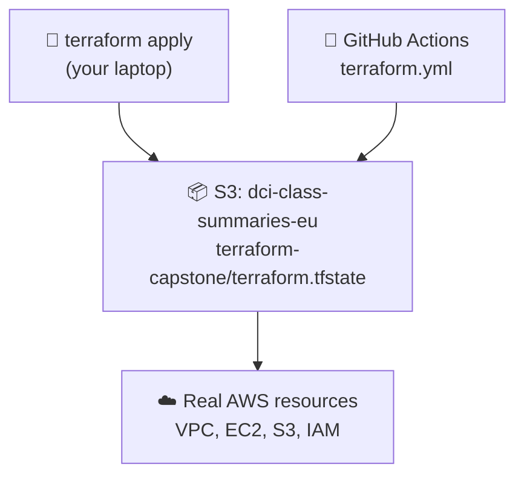
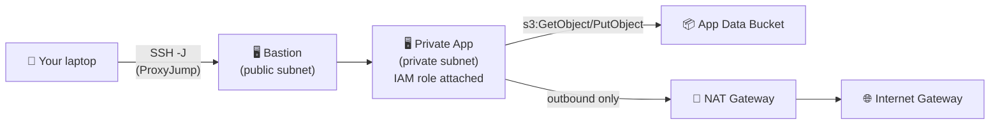

# Week 4 — Capstone

## What this combines

Everything from weeks 1–3 into one stack:
- VPC with public + private subnets, IGW, NAT Gateway (Week 2)
- Bastion host in the public subnet, private app instance with an IAM role + S3 bucket (Week 3)
- **New — remote state**: state is stored in S3 (`backend "s3" {}` in `main.tf`) instead of a local file

## Why remote state matters

Local `terraform.tfstate` only exists on your machine. If it's lost, Terraform no longer knows what it created — it can't safely update or destroy anything. Remote state (S3 here) means:
- State survives your laptop dying
- Multiple people/CI can safely run Terraform against the same infrastructure (S3 + a lock mechanism prevents two applies colliding)
- This is the same `dci-class-summaries-eu` bucket your class-summary site already deploys to, just a different `key` path (`terraform-capstone/terraform.tfstate`) so it doesn't collide with the site's own files



## Full request flow this stack builds



> 🏢 **Real world:** This is the standard "three-tier" pattern almost every serious AWS shop uses: a jump box for human access, private instances that do the real work with IAM roles (no keys), and remote state so infrastructure changes go through code review and CI instead of someone's laptop. Companies like Airbnb keep their Terraform state in S3 with DynamoDB locking for exactly this reason — so two engineers running `apply` at the same time don't corrupt each other's changes.

## Run it

```bash
cd terraform/day4
cp terraform.tfvars.example terraform.tfvars   # set admin_cidr, student_suffix, key_pair_name
terraform init      # this time it also configures the S3 backend
terraform plan
terraform apply
```

SSH in via the bastion (uses the `ssh_via_bastion_hint` output):
```bash
terraform output ssh_via_bastion_hint
```

**Cost note:** NAT Gateway + 2x EC2 running. Destroy when your session is done:
```bash
terraform destroy
```
